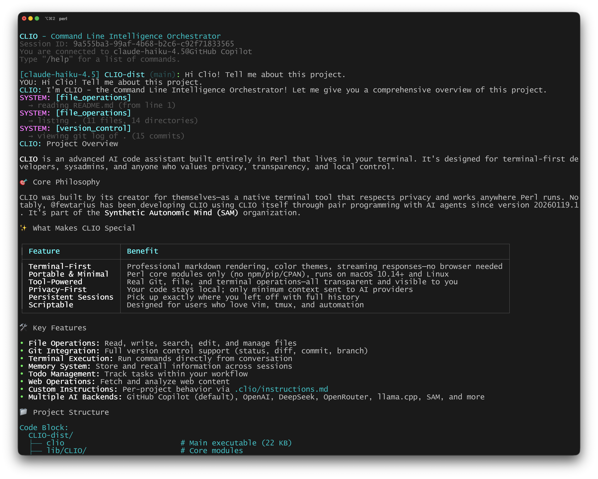
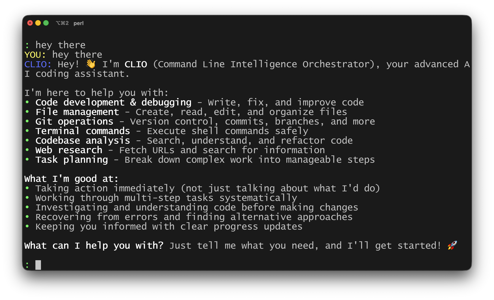
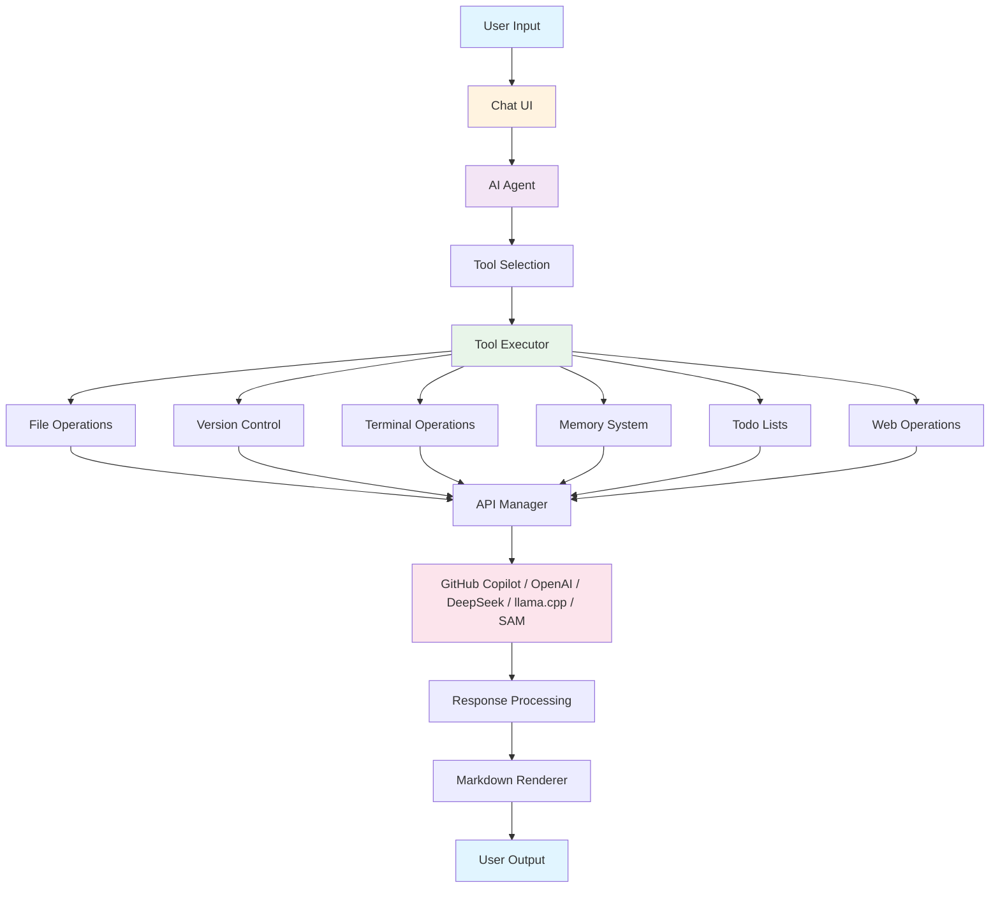

# CLIO - Command Line Intelligence Orchestrator

**An AI code assistant for people who live in the terminal. Portable, privacy-first, and designed for real work.**

━━━━━━━━━━━━━━━━━━━━━━━━━━━━━━━━━━━━━━━━━━━━━━━━━━━

## Why I Built CLIO

I built CLIO for myself. As someone who prefers working in the terminal, I wanted an AI assistant that felt native to my workflow. One that respected my privacy, worked anywhere Perl runs, and gave me full control over my code and tools. I couldn't find anything that met those needs, so I created CLIO.

Starting with version 20260119.1, CLIO has been building itself. All of my development is now done through pair programming with AI agents using CLIO.

CLIO is part of the [Synthetic Autonomic Mind (SAM)](https://github.com/SyntheticAutonomicMind) organization, which is dedicated to building user-first, privacy-respecting AI tools. If you value transparency, portability, and the power of the command line, CLIO is for you.

━━━━━━━━━━━━━━━━━━━━━━━━━━━━━━━━━━━━━━━━━━━━━━━━━━━

## What Makes CLIO Different

- **Terminal-First Experience:** CLIO runs entirely in your terminal, with professional markdown rendering, color themes, and streaming output. No browser, no GUI overlays, just a clean, native interface.
- **Portable & Minimal:** No CPAN, npm, or pip dependencies, just Perl core modules. Install and run CLIO on any modern macOS or Linux system in minutes.
- **Tool-Powered, Not Simulated:** All file, git, and terminal operations are performed using real system tools. Every action is described in real time, so you always know what's happening.
- **Privacy & Control:** Your code and conversations stay on your machine. Only the minimum context needed for AI is sent to providers, and all sessions and memories are stored locally.
- **Persistent Sessions:** Pick up exactly where you left off, with full conversation and tool history.
- **Scriptable & Extensible:** Designed for users who prefer Vim to VSCode, tmux to tabs, and scripts to clicks. CLIO fits into your workflow, not the other way around.

━━━━━━━━━━━━━━━━━━━━━━━━━━━━━━━━━━━━━━━━━━━━━━━━━━━

## Who is CLIO For?

- Terminal-first developers, sysadmins, and power users
- Anyone who values privacy, transparency, and local control
- Users who want a professional, readable terminal UI (with real markdown rendering)
- People who prefer tools that work everywhere, without external dependencies

━━━━━━━━━━━━━━━━━━━━━━━━━━━━━━━━━━━━━━━━━━━━━━━━━━━

## Core Features

- **File Operations:** Read, write, search, edit, and manage files
- **Version Control:** Full Git integration (status, diff, commit, branch, push, pull, stash, tag)
- **Remote Execution:** Run CLIO tasks on remote systems via SSH - analyze servers, build on specific hardware, coordinate across multiple devices
- **Terminal Execution:** Run commands and scripts directly from conversation
- **Memory System:** Store and recall information across sessions
- **Todo Lists:** Manage tasks within your workflow
- **Web Operations:** Fetch and analyze web content
- **Custom Instructions:** Per-project AI behavior via `.clio/instructions.md` and/or `AGENTS.md` (supports open standard, enforces standards, passes methodology, adapts to your workflow)
- **Action Transparency:** See exactly what CLIO is doing in real-time, with clear, contextual descriptions for all tool operations
- **Persistent Session Management:** Conversations saved automatically with full history; resume any session exactly where you left off
- **Beautiful Terminal UI:** Professional markdown rendering with syntax highlighting, color-coded system messages, and streaming responses
- **Multiple AI Backend Support:** GitHub Copilot (default), OpenAI, DeepSeek, OpenRouter, llama.cpp, SAM, and more

━━━━━━━━━━━━━━━━━━━━━━━━━━━━━━━━━━━━━━━━━━━━━━━━━━━

## Screenshots

Get a glimpse of CLIO's beautiful terminal interface in action:

<table>
  <tr>
    <td width="50%">
      <h3>CLIO's Simple Interface</h3>
      
    </td>
    <td width="50%">
      <h3>Claude Haiku describing CLIO</h3>
      
    </td>
  </tr>
</table>

━━━━━━━━━━━━━━━━━━━━━━━━━━━━━━━━━━━━━━━━━━━━━━━━━━━

## Quick Start

### Installation

**Homebrew (macOS)**

```bash
brew tap SyntheticAutonomicMind/homebrew-SAM
brew install clio
```

**Manual Installation**

```bash
# Clone the repository
git clone https://github.com/SyntheticAutonomicMind/CLIO.git
cd clio

# Run the installer
sudo ./install.sh
```

For detailed installation options and troubleshooting, see [docs/INSTALLATION.md](docs/INSTALLATION.md).

### Configure Your AI Provider

**GitHub Copilot** (Default - Recommended)

No configuration needed! Just start CLIO and run `/api login`:

```bash
./clio
: /api login
# Follow the browser prompts to authorize
```

**Alternative Providers**

Use `/api` commands within CLIO:

```bash
./clio
: /api set provider openai
: /api set key YOUR_OPENAI_API_KEY
: /api set model gpt-4o
: /config save
```

See [docs/USER_GUIDE.md](docs/USER_GUIDE.md) for full provider configuration details.

### Start Your First Session

```bash
# Start a new conversation
./clio --new

# Resume your last session
./clio --resume

# Enable debug mode
./clio --debug
```

━━━━━━━━━━━━━━━━━━━━━━━━━━━━━━━━━━━━━━━━━━━━━━━━━━━

## Remote Execution - Distributed AI Workflows

**Run CLIO tasks on any SSH-accessible system.** Execute AI-powered tasks on remote servers, build on specific hardware, or coordinate work across multiple devices.

### Quick Example

```
: Execute on user@buildserver with gpt-4.1: analyze system hardware and check disk space
```

CLIO will:
1. SSH into the remote system
2. Copy itself to the remote (version consistency guaranteed)
3. Execute your task with the AI model
4. Return results and any requested files
5. Clean up automatically

### What You Can Do

| Use Case | Example |
|----------|---------|
| **System Analysis** | Gather diagnostics from production servers |
| **Distributed Builds** | Compile on ARM, x86, or specific hardware |
| **Multi-Device Testing** | Run tests across different environments simultaneously |
| **Infrastructure Audit** | Analyze multiple systems from one location |
| **Remote Debugging** | Investigate issues on staging/production systems |

### Requirements

1. **SSH key authentication** (required - no password prompts)
2. **ssh-agent running** with key loaded
3. **Perl 5.32+** on remote system
4. **~50MB disk space** in /tmp on remote

### Setup (5 Minutes)

```bash
# 1. Generate SSH key (if needed)
ssh-keygen -t ed25519 -C "your_email@example.com"

# 2. Start ssh-agent
eval "$(ssh-agent -s)"

# 3. Add key to agent
ssh-add ~/.ssh/id_ed25519

# 4. Copy key to remote
ssh-copy-id user@remote-host

# 5. Test connection (should NOT prompt for password)
ssh user@remote-host exit
```

CLIO validates your SSH setup before execution and provides clear guidance if anything is missing.

### Example Workflows

**System Diagnostics:**
```
: Use remote_execution on admin@server1: create a system health report
```

**Parallel Analysis:**
```
: Execute on [server1, server2, server3]: report disk usage by directory
```

**Hardware-Specific Builds:**
```
: On builder@arm-device: clone PROJECT, build for ARM64, report errors
```

See [docs/REMOTE_EXECUTION.md](docs/REMOTE_EXECUTION.md) for complete documentation, device management, and advanced workflows.

━━━━━━━━━━━━━━━━━━━━━━━━━━━━━━━━━━━━━━━━━━━━━━━━━━━

## Example Usage

```
YOU: Please list the files in the current directory

SYSTEM: [file_operations] - listing ./ (15 files, 8 directories)

CLIO: I can see you have several files here:

**Directories:**
- lib/ (source code modules)
- docs/ (documentation)
- scripts/ (utility scripts)

**Files:**
- clio (main executable)
- README.md
- install.sh
...
```

━━━━━━━━━━━━━━━━━━━━━━━━━━━━━━━━━━━━━━━━━━━━━━━━━━━

## Remote Execution - Distributed AI Workflows

**Run CLIO tasks on any SSH-accessible system.** Execute AI-powered tasks on remote servers, build on specific hardware, or coordinate work across multiple devices.

### Quick Example

```
: Execute on user@buildserver with gpt-4.1: analyze system hardware and check disk space
```

CLIO will:
1. SSH into the remote system
2. Copy itself to the remote (version consistency guaranteed)
3. Execute your task with the AI model
4. Return results and any requested files
5. Clean up automatically

### What You Can Do

| Use Case | Example |
|----------|---------|
| **System Analysis** | Gather diagnostics from production servers |
| **Distributed Builds** | Compile on ARM, x86, or specific hardware |
| **Multi-Device Testing** | Run tests across different environments simultaneously |
| **Infrastructure Audit** | Analyze multiple systems from one location |
| **Remote Debugging** | Investigate issues on staging/production systems |

### Requirements

1. **SSH key authentication** (required - no password prompts)
2. **ssh-agent running** with key loaded
3. **Perl 5.32+** on remote system
4. **~50MB disk space** in /tmp on remote

### Setup (5 Minutes)

```bash
# 1. Generate SSH key (if needed)
ssh-keygen -t ed25519 -C "your_email@example.com"

# 2. Start ssh-agent
eval "$(ssh-agent -s)"

# 3. Add key to agent
ssh-add ~/.ssh/id_ed25519

# 4. Copy key to remote
ssh-copy-id user@remote-host

# 5. Test connection (should NOT prompt for password)
ssh user@remote-host exit
```

CLIO validates your SSH setup before execution and provides clear guidance if anything is missing.

### Example Workflows

**System Diagnostics:**
```
: Use remote_execution on admin@server1: create a system health report
```

**Parallel Analysis:**
```
: Execute on [server1, server2, server3]: report disk usage by directory
```

**Hardware-Specific Builds:**
```
: On builder@arm-device: clone PROJECT, build for ARM64, report errors
```

See [docs/REMOTE_EXECUTION.md](docs/REMOTE_EXECUTION.md) for complete documentation, device management, and advanced workflows.

━━━━━━━━━━━━━━━━━━━━━━━━━━━━━━━━━━━━━━━━━━━━━━━━━━━

## Interactive Features & Usability

CLIO is designed for productive terminal interaction with powerful shortcuts and controls:

### Keyboard Controls

**During Responses:**
- **`Space` / `Any Key`**: Continue to next page when response is longer than your terminal height
- **`q` / `Q`**: Quit pagination and return to prompt
- **`^` / `v` (Up/Down Arrows)**: Navigate between pages (non-streaming mode only)
- **`Ctrl+D`** or **`Ctrl+C`**: Exit CLIO

**In Text Input:**
- **`←` / `→` (Left/Right Arrows)**: Move cursor one character
- **`Option+←` / `Option+→` (Alt+Left/Right)**: Jump forward/backward by word
- **`Home` / `End`**: Move to beginning/end of line
- **`Ctrl+A` / `Ctrl+E`**: Move to start/end of line (emacs mode)
- **`Tab`**: Auto-complete commands and file paths
- **`Escape`**: Cancel multi-line input or interrupt workflow (returns to prompt while staying in session)

### Input Modes

**Single-Line Input (Default)**
```
: Your question here...
```

**Multi-Line Input** - Open your editor for complex prompts:
```
: /multiline
# or
: /ml
# (Opens $EDITOR for full prompt composition)
```

### Smart Pagination

CLIO automatically handles long responses intelligently:

- **During AI Thinking**: No pagination interruption (you see tool operations flow freely)
- **During Final Response**: Automatic pause at screen height (type any key to continue)
- **Stream Mode**: Quick confirmation pauses (press any key to keep reading)
- **Page Navigation**: Use arrow keys to scroll back through pages (non-streaming)

This means you can stay focused—no constant "press space" prompts during tool work, but clean pagination when the AI is talking to you.

━━━━━━━━━━━━━━━━━━━━━━━━━━━━━━━━━━━━━━━━━━━━━━━━━━━

## Slash Commands Reference

CLIO provides 35+ powerful slash commands organized by category. Type `/help` in any session to see the full list, or reference below:

### Basics
| Command | Purpose |
|---------|---------|
| `/help`, `/h` | Display command help |
| `/exit`, `/quit`, `/q` | Exit CLIO |
| `/clear` | Clear screen |

### Project Setup
| Command | Purpose |
|---------|---------|
| `/design` | Collaborative PRD development with AI architect |
| `/init` | Initialize project with custom instructions |
| `/init --force` | Re-initialize project (updates instructions from PRD) |

### API & Configuration
| Command | Purpose |
|---------|---------|
| `/api` | Show API settings help |
| `/api set provider <name>` | Change AI provider |
| `/api set model <name>` | Set AI model |
| `/api set key <value>` | Set API key |
| `/api models` | List available models |
| `/api login` | Authenticate with GitHub Copilot |
| `/api logout` | Sign out from GitHub |
| `/config save` | Save configuration to file |
| `/config show` | Display current configuration |

### Session Management
| Command | Purpose |
|---------|---------|
| `/session list` | List all saved sessions |
| `/session switch <id>` | Resume a specific session |
| `/session trim [days]` | Remove sessions older than N days (default: 30) |

### File & Git Operations
| Command | Purpose |
|---------|---------|
| `/file read <path>` | View file contents |
| `/file write <path>` | Create/overwrite file |
| `/file edit <path>` | Edit file in $EDITOR |
| `/read <path>` | View file (shorthand) |
| `/edit <path>` | Edit file (shorthand) |
| `/git status` | Show git status |
| `/git diff [file]` | Show git differences |
| `/git log [n]` | Show commit history |
| `/git commit [msg]` | Create git commit |
| `/git branch` | List/create/delete branches |
| `/git switch <name>` | Switch to branch |
| `/git push [remote] [branch]` | Push changes to remote |
| `/git pull [remote] [branch]` | Pull changes from remote |
| `/git stash [save\|apply\|drop]` | Manage stashed changes |
| `/git tag [name]` | List/create/delete tags |
| `/git blame <file>` | Show who changed each line |
| `/status` | Show git status (shorthand) |
| `/diff` | Show git diff (shorthand) |
| `/commit` | Create commit (shorthand) |

### Task Management
| Command | Purpose |
|---------|---------|
| `/todo` | View agent's current todo list |
| `/todo add <text>` | Add new todo |
| `/todo done <id>` | Mark todo as complete |

### Memory & Learning
| Command | Purpose |
|---------|---------|
| `/memory` | View long-term memory patterns |
| `/memory list [type]` | List discoveries, solutions, patterns |
| `/memory store <type>` | Store new pattern (via AI) |
| `/memory stats` | Show LTM statistics |
| `/memory prune [days]` | Remove old/low-confidence entries |
| `/memory clear` | Clear all patterns |

### Developer Tools
| Command | Purpose |
|---------|---------|
| `/explain [file]` | Explain code |
| `/review [file]` | Review code quality |
| `/test [file]` | Generate tests |
| `/fix <file>` | Propose bug fixes |
| `/doc <file>` | Generate documentation |

### Skills & Customization
| Command | Purpose |
|---------|---------|
| `/skills` | List all skills (built-in and custom) |
| `/skills search` | Browse skills catalog |
| `/skills install <name>` | Install skill from catalog |
| `/skills use <name>` | Execute a skill |
| `/prompt` | Manage system prompts |
| `/style` | Change interface style |
| `/theme` | Change color theme |

### Execution & Utilities
| Command | Purpose |
|---------|---------|
| `/exec <cmd>` | Run shell command directly |
| `/shell` | Drop to shell subshell |
| `/billing` | Show API usage statistics |
| `/performance` | Show performance metrics |
| `/context` | Manage context files |
| `/debug` | Toggle debug output |
| `/loglevel <level>` | Set logging verbosity (error/warn/info/debug) |
| `/multiline`, `/ml` | Open editor for multi-line input |
| `/update check` | Check for CLIO updates |

**Tip:** Use `/help` inside CLIO to see an interactive, paginated command reference with descriptions.

━━━━━━━━━━━━━━━━━━━━━━━━━━━━━━━━━━━━━━━━━━━━━━━━━━━

## Session Management

CLIO automatically saves all conversations:

```bash
# Start a new session
./clio --new

# Resume last session
./clio --resume

# Resume specific session
./clio --resume sess_20260118_143052

# List all sessions
ls ~/.clio/sessions/

# Start with debug output
./clio --debug --new
```

Sessions include:
- Full conversation history
- Tool operations performed
- Memory context
- Timestamps
- Model and provider information

**Never lose context**—resume any session months later and pick up exactly where you left off.

━━━━━━━━━━━━━━━━━━━━━━━━━━━━━━━━━━━━━━━━━━━━━━━━━━━

## Configuration

CLIO is configured **interactively** using slash commands:

```bash
# GitHub Copilot (default) - just login
: /api login

# Other providers - use /api set commands
: /api set provider openai
: /api set key YOUR_API_KEY
: /api set model gpt-4o
: /config save

# View current configuration
: /config show
: /api
```

**Optional: Environment variables** (advanced users)

```bash
# Session Directory
export CLIO_SESSION_DIR="$HOME/.clio/sessions"

# Custom library path (if installed to non-standard location)
export PERL5LIB="/path/to/lib:$PERL5LIB"
```

**Note:** API keys and provider selection are configured with `/api` commands, not environment variables. Use `clio --debug` for debug output.

For advanced configuration options, see [docs/USER_GUIDE.md](docs/USER_GUIDE.md).

━━━━━━━━━━━━━━━━━━━━━━━━━━━━━━━━━━━━━━━━━━━━━━━━━━━

## Custom Instructions

CLIO supports **per-project custom instructions** via `.clio/instructions.md` and/or **`AGENTS.md`** (open standard). This lets you:
- Enforce project-specific coding standards automatically
- Pass methodology and best practices to CLIO
- Adapt CLIO's behavior to your workflow
- Share project context without repeating it every session
- **Use the AGENTS.md standard (60k+ projects, 20+ AI tools)**

### Quick Example - AGENTS.md (Recommended)

Create `AGENTS.md` at your project root:

```markdown
# AGENTS.md

## Setup Commands

- Install deps: `npm install`
- Run tests: `npm test`

## Code Style

- TypeScript strict mode
- Single quotes, no semicolons
- Follow project ESLint config
```

### Quick Example - .clio/instructions.md (CLIO-specific)

Create `.clio/instructions.md` for CLIO-specific behavior:

```markdown
# CLIO Instructions

This project follows The Unbroken Method for AI collaboration.

## Standards

- Always investigate code before making changes
- Fix all discovered problems (complete ownership)
- No "TODO" comments in final code
```

When you start CLIO in that directory, it automatically:
1. Reads `.clio/instructions.md` (if exists)
2. Reads `AGENTS.md` (if exists, walks up directory tree)
3. **Merges and injects both into the AI system prompt**
4. Uses them to guide all code suggestions and tool operations

**You can use one OR both!** AGENTS.md for universal guidance + .clio/instructions.md for CLIO-specific behavior.

For complete documentation and examples, see:
- **[AGENTS.md Support](docs/AGENTS_MD_SUPPORT.md)** - New! AGENTS.md standard support
- **[Custom Instructions Guide](docs/CUSTOM_INSTRUCTIONS.md)** - Complete guide with examples

━━━━━━━━━━━━━━━━━━━━━━━━━━━━━━━━━━━━━━━━━━━━━━━━━━━

## Real-World Workflows

Here are common patterns for using CLIO effectively:

### Project Design & Setup Workflow

```
YOU: /design

CLIO: Let's design your application together. Tell me about your 
      project idea - what problem are you trying to solve?

YOU: I want to build a task management CLI tool

CLIO: Interesting! A CLI task manager. Let's explore this...
      - Who's the primary user? Developers? General users?
      - What's missing from existing tools like todo.txt or taskwarrior?
      - Do you need sync across devices, or local-only?

[Collaborative architecture conversation via user_collaboration]
[CLIO suggests patterns, explores trade-offs, designs architecture]

CLIO: Based on our discussion, I've created a comprehensive PRD at 
      .clio/PRD.md with:
      - SQLite for local storage
      - Simple CLI with subcommands
      - Tag-based organization
      - Priority levels and due dates
      
      Would you like to initialize the project? (Type '/init')

YOU: /init

[CLIO reads PRD, fetches methodology docs, analyzes codebase]
[Creates .clio/instructions.md with project-specific guidance]

CLIO: Project initialized! Your custom instructions include:
      - Code standards for Perl CLI tools
      - Testing strategy from your PRD
      - Architecture patterns we discussed
      
      Ready to start coding?
```

Later, when the PRD needs updates:

```
YOU: /design

CLIO: I found your existing PRD (last updated 3 days ago).
      [Shows summary of current design]
      
      What's changed? New requirements? Technical insights?

YOU: We need to add a web API for mobile app integration

CLIO: That's a significant architecture change. Let's think through...
      - RESTful API with the same SQLite backend?
      - Authentication needed?
      - Real-time sync or polling?
      
[Collaborative review, updates PRD with new architecture]

CLIO: PRD updated with API architecture. Your design has evolved 
      significantly - consider running '/init --force' to update 
      project instructions.

YOU: /init --force

[Backs up old instructions, regenerates from updated PRD]
```

### Code Review & Fix Workflow

```
YOU: Please review lib/CLIO/Core/Main.pm

[CLIO reviews file, identifies issues]

YOU: /fix lib/CLIO/Core/Main.pm

[CLIO proposes fixes, explains changes]

YOU: Looks good, make the changes

[CLIO modifies file with real file_operations]

YOU: /git status

[Shows file changes]

YOU: Let's commit these

[CLIO commits with proper message]
```

### Multi-File Refactoring

```
YOU: /multiline
# [Opens editor]
# Refactor lib/CLIO/Tools/*.pm to use consistent error handling
# Make all error messages go through CLIO::Core::Logger
# Update tests in tests/unit/ to verify error handling

[CLIO analyzes all files, creates plan, executes changes]

YOU: Show me the diff

[CLIO shows all changes with context]

YOU: Perfect, let's test

[CLIO runs tests, reports results]
```

### Interactive Todo Management

```
YOU: /todo
[Shows current todos]

YOU: /todo add "Refactor Session.pm for performance"
[Added]

YOU: Let me work on that...
[Provides detailed plan and implements]

YOU: /todo done 5
[Marks todo 5 complete]

YOU: What's left?
[CLIO shows remaining todos from context]
```

### Research & Documentation

```
YOU: /context add https://example.com/api/docs

[CLIO fetches and stores API documentation]

YOU: Generate docs for our API wrapper module

[CLIO uses stored context to write docs]

YOU: /file write docs/API.md

[Writes documentation with real file operations]
```

━━━━━━━━━━━━━━━━━━━━━━━━━━━━━━━━━━━━━━━━━━━━━━━━━━━

## Requirements

- **Operating System:** macOS 10.14+ or Linux (any modern distribution)
- **Perl:** Version 5.20 or higher (core modules only, no CPAN dependencies)
- **Git:** Required for version control operations
- **Terminal:** Any ANSI-compatible terminal emulator
- **Editor:** Optional, for `/multiline` input (defaults to `$EDITOR` env var, then vim)

━━━━━━━━━━━━━━━━━━━━━━━━━━━━━━━━━━━━━━━━━━━━━━━━━━━

## Streaming & Real-Time Feedback

CLIO provides real-time streaming responses with smart behavior:

**AI Responses Stream Immediately:**
- You see text appearing as it's generated
- Markdown rendering applies live
- Code blocks appear with syntax highlighting

**Tool Operations Show Live:**
```
SYSTEM: [file_operations] - Reading ./lib/Main.pm (245 lines)
SYSTEM: [git] - Executing git status in ./
SYSTEM: [terminal] - Running: perl -I./lib -c lib/Main.pm
```

Every action is transparent and immediate—no hidden work, no waiting.

**Pagination Is Smart:**
- During tool execution: Free-flowing (no interruptions)
- During final response: Automatic pause at screen height
- Navigation: Use arrow keys to review earlier pages

━━━━━━━━━━━━━━━━━━━━━━━━━━━━━━━━━━━━━━━━━━━━━━━━━━━

## Design Philosophy

- **Terminal-First:** Designed for developers who live in the terminal. No web browser required, no GUI overhead.
- **Action Transparency:** Every tool operation shows exactly what it's doing. You always know what CLIO is reading, writing, or executing.
- **Persistent Context:** Sessions persist across restarts. Your conversation history and context are never lost.
- **Professional Output:** Markdown rendering that's actually readable in the terminal, with syntax highlighting and proper formatting.
- **Tool-Powered:** The AI doesn't hallucinate file contents or command output, it uses real tools to interact with your system.
- **Privacy-Conscious:** Your code and conversations stay on your machine. API calls only send the context necessary for the current request.

━━━━━━━━━━━━━━━━━━━━━━━━━━━━━━━━━━━━━━━━━━━━━━━━━━━

## Architecture

CLIO uses a modular Perl-based architecture:



See [docs/ARCHITECTURE.md](docs/ARCHITECTURE.md) for detailed system design.

━━━━━━━━━━━━━━━━━━━━━━━━━━━━━━━━━━━━━━━━━━━━━━━━━━━

## Documentation

- **[User Guide](docs/USER_GUIDE.md):** Complete usage guide with examples
- **[Architecture](docs/ARCHITECTURE.md):** System design and component overview
- **[Custom Instructions](docs/CUSTOM_INSTRUCTIONS.md):** Per-project AI behavior and standards enforcement
- **[Feature Completeness](docs/FEATURE_COMPLETENESS.md):** Status of all features (what's done, what's partial, what's planned)
- **[Installation Guide](docs/INSTALLATION.md):** Setup and installation instructions
- **[Developer Guide](docs/DEVELOPER_GUIDE.md):** Extending CLIO and contributing
- **[Technical Specs](docs-internal/):** Detailed specifications (protocols, UI, memory, etc.)

━━━━━━━━━━━━━━━━━━━━━━━━━━━━━━━━━━━━━━━━━━━━━━━━━━━

## Contributing

Contributions are welcome! Please see [docs/DEVELOPER_GUIDE.md](docs/DEVELOPER_GUIDE.md) for:
- Code organization and structure
- How to add new tools
- How to add new AI providers
- Testing guidelines
- Code standards

━━━━━━━━━━━━━━━━━━━━━━━━━━━━━━━━━━━━━━━━━━━━━━━━━━━

## License

CLIO is licensed under the GNU General Public License v3.

See [LICENSE](LICENSE) for full license text.

━━━━━━━━━━━━━━━━━━━━━━━━━━━━━━━━━━━━━━━━━━━━━━━━━━━

## Support

- **Issues:** [GitHub Issues](https://github.com/SyntheticAutonomicMind/CLIO/issues)
- **Discussions:** [GitHub Discussions](https://github.com/SyntheticAutonomicMind/CLIO/discussions)
