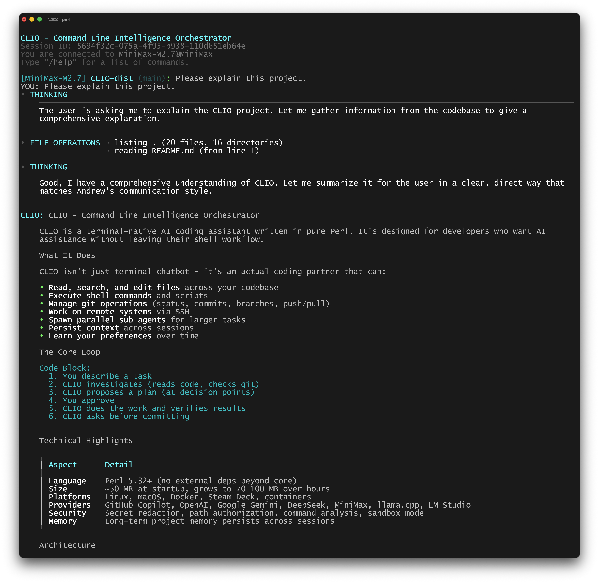
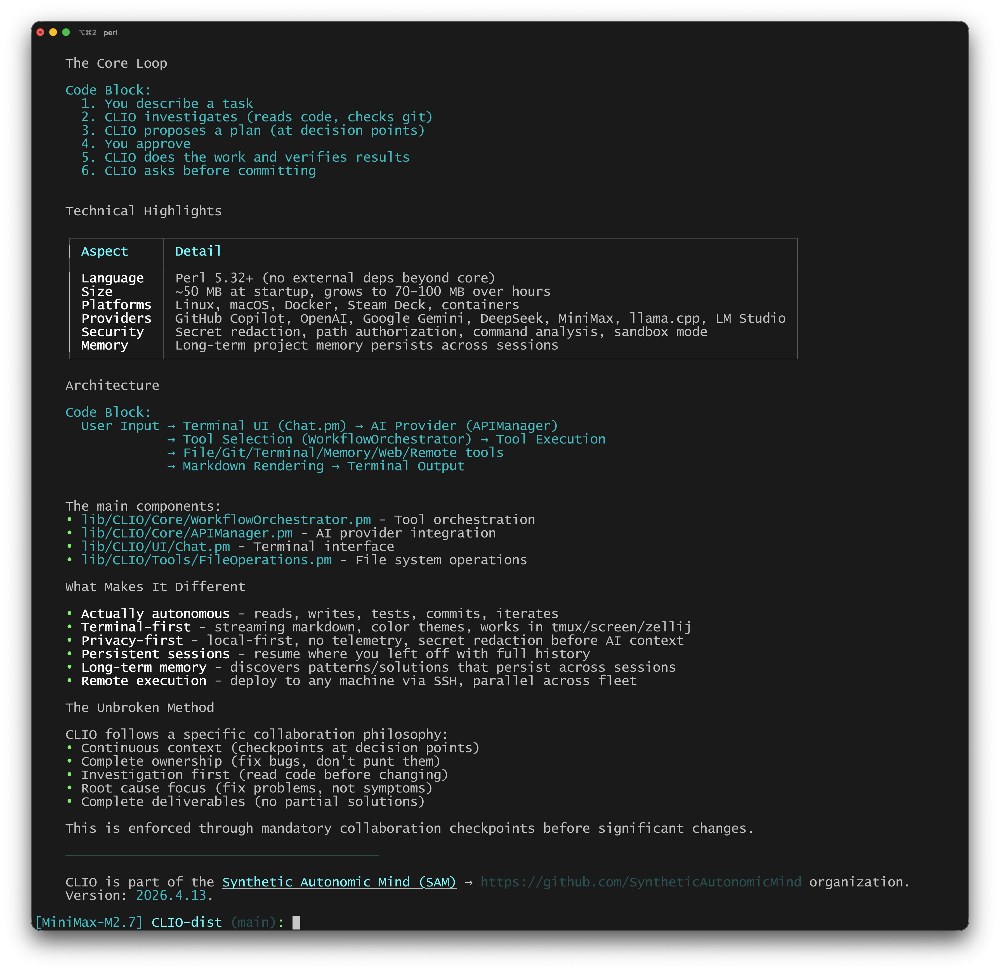

# CLIO - Command Line Intelligence Orchestrator

**A terminal-native AI coding tool that reads your code, edits files, runs commands, uses git, and works through tasks with you.**

I built CLIO for myself. I spend more time in terminal sessions than I do using GUIs, and I wanted a terminal-first AI development tool that worked the way I work. It didn't really exist, so I built it. Since early 2026, CLIO has been building itself - all development on SAM, CLIO, and ALICE is done through pair programming with AI agents using CLIO.

[](LICENSE) [](docs/DEPENDENCIES.md) [](https://github.com/orgs/SyntheticAutonomicMind/discussions)

---

## What You Can Do With CLIO

- **Give it a task, it does the work** - CLIO investigates your codebase, proposes a plan, you approve, it implements. Edits files, runs tests, commits changes.
- **Work from anywhere** - Local shells, SSH sessions, tmux, Docker, headless servers. Anywhere Perl runs.
- **Zero dependencies** - Pure Perl with standard core modules. No CPAN, no npm, no pip. Install and run.
- **Pick up where you left off** - Persistent sessions with full history. Long-term memory carries across projects.
- **Coordinate parallel agents** - Spawn sub-agents with file locks, git locks, and rate limiting.
- **Run across your fleet** - SSH into any machine, deploy CLIO, run a task, get results.
- **Stay private** - Secret redaction catches API keys and tokens before they reach the AI. Your code stays on your machine.
- **Interrupt anytime** - Press any key to stop mid-task. CLIO pauses, asks what you need, and adapts.

CLIO works like pair programming, not prompt-and-response chat. You describe the task, CLIO investigates your code, proposes a plan, and implements after your approval.

---

## Core Features

| Category | Capabilities |
|----------|--------------|
| **Files** | Read, write, search, edit, manage files |
| **Git** | Status, diff, commit, branch, push, pull, stash, tag, worktree |
| **Terminal** | Execute commands and scripts directly |
| **Remote** | Run AI tasks on remote systems via SSH |
| **Multi-Agent** | Spawn parallel agents with file locks, git locks, and rate limiting |
| **Multiplexer** | Live agent output panes via tmux, GNU Screen, or Zellij |
| **Memory** | Short-term sessions plus long-term memory across projects |
| **Profile** | Learns your working style and personalizes collaboration |
| **Todos** | Manage tasks within your workflow |
| **Undo** | Revert AI changes from any turn |
| **Skills** | Custom AI skills loaded from Git repositories |
| **Plugins** | Drop-in tool extensions |
| **OpenSpec** | Spec-driven development with AI-generated artifacts |
| **Web** | Fetch and analyze web content |
| **MCP** | Connect to external tool servers via [Model Context Protocol](docs/MCP.md) |

## Slash Commands

Type `/help` in any session for the full list. Highlights:

- `/api` - providers, models, login, thinking
- `/config` - global settings, persistence
- `/session` - history, switch, export
- `/memory` - long-term patterns
- `/skills` - manage custom skills
- `/spec` - OpenSpec lifecycle
- `/agent` - sub-agents (spawn, inbox, status)
- `/mcp` - Model Context Protocol servers
- `/undo` - revert changes from the last turn
- `/profile` - working-style profile
- `/update` - in-place version updates
- `/usage` - billing and token usage
- `/stats` - performance and memory

See [docs/USER_GUIDE.md](docs/USER_GUIDE.md#slash-commands) for the complete reference.

---

## AI Providers

CLIO ships with **18 provider configurations**. All API providers are OpenAI-compatible; Anthropic, Google, and NVIDIA have native protocol adapters.

| Provider | Auth |
|----------|------|
| **GitHub Copilot** | OAuth |
| **Anthropic** | API Key |
| **OpenAI** | API Key |
| **Google Gemini** | API Key |
| **DeepSeek** | API Key |
| **OpenRouter** | API Key |
| **OrcaRouter** | API Key |
| **KiloCode** | API Key |
| **Ollama Cloud** | API Key |
| **MiniMax** | API Key |
| **MiniMax Token Plan** | API Key |
| **Z.AI** | API Key |
| **Z.AI Coding Plan** | API Key |
| **NVIDIA NIM** | API Key |
| **Vercel AI Gateway** | API Key |
| **llama.cpp** | None |
| **LM Studio** | None |
| **SAM** | API Key |

See [docs/PROVIDERS.md](docs/PROVIDERS.md) for setup instructions for each provider.

---

## Screenshots

<table>
  <tr>
    <td width="50%">
      <h3>CLIO's Simple User Interface (1/2)</h3>
      <a href="https://raw.githubusercontent.com/SyntheticAutonomicMind/CLIO/main/.images/clio1.png">
        
      </a>
    </td>
    <td width="50%">
      <h3>CLIO's Simple User Interface (2/2)</h3>
      <a href="https://raw.githubusercontent.com/SyntheticAutonomicMind/CLIO/main/.images/clio2.png">
        
      </a>
    </td>
  </tr>
</table>

---

## Quick Start

### Check Dependencies

```bash
./check-deps  # Verify all required tools are installed
```

CLIO requires standard Unix tools (git, curl, perl 5.32+, etc.). See [docs/DEPENDENCIES.md](docs/DEPENDENCIES.md) for details.

### Install

**Homebrew (macOS)**
```bash
brew tap SyntheticAutonomicMind/homebrew-SAM
brew install clio
```

**Docker (Any Platform)**
```bash
docker run -it --rm \
    -v "$(pwd)":/workspace \
    -v clio-auth:/root/.clio \
    -w /workspace \
    ghcr.io/syntheticautonomicmind/clio:latest \
    --new
```

**Manual**
```bash
git clone https://github.com/SyntheticAutonomicMind/CLIO.git
cd CLIO && sudo ./install.sh
```

For detailed options, see [docs/INSTALLATION.md](docs/INSTALLATION.md).

### Configure AI Provider

**GitHub Copilot**
```bash
./clio
: /api login
# Follow browser prompts to authorize
```

**Other Providers**
```bash
./clio
: /api set provider openai
: /api set key YOUR_API_KEY
: /config save
```

Run `/api models` after configuring a provider to see available models.

### First Prompt

Start with something grounded in a real repository:

```text
Read this project and tell me how configuration is loaded.
```

Or give CLIO a real bug to investigate:

```text
Find the bug causing the login endpoint to return 500 when the session is expired.
```

### Start Using CLIO

```bash
./clio --new          # New conversation
./clio --resume       # Resume last session
./clio --debug        # Debug mode
./clio --enable file_operations  # Restrict to specific tools
./clio --disable web_operations  # Block specific tools
./clio --sandbox --new  # Sandbox mode (restricts file access)
```

---

## Requirements

- **macOS 10.14+** or **Linux** (any modern distribution)
- **Perl 5.32+** (included with most systems)
- **Git** (for version control operations)
- **ANSI-compatible terminal**

---

## Privacy and Security

CLIO runs with defense-in-depth security:

- **Secret redaction** - API keys, tokens, and credentials are stripped from AI context before it reaches the model
- **Command analysis** - Shell commands are classified by risk level (network, credential access, destructive) and require your approval for high-risk operations
- **Path authorization** - File access outside the project directory requires your permission
- **Sandbox mode** - `--sandbox` blocks web/remote/agent access and restricts file operations to the project directory
- **Container isolation** - `clio-container` provides full OS-level isolation via Docker
- **Invisible character filtering** - Unicode-based prompt injection attacks are blocked automatically

See [docs/SECURITY.md](docs/SECURITY.md) and [docs/SANDBOX.md](docs/SANDBOX.md) for details.

---

## Part of the Ecosystem

CLIO is part of [Synthetic Autonomic Mind](https://github.com/SyntheticAutonomicMind) - a family of open source AI tools:

- **[SAM](https://github.com/SyntheticAutonomicMind/SAM)** - Native macOS AI assistant with voice control, document analysis, and image generation
- **[ALICE](https://github.com/SyntheticAutonomicMind/ALICE)** - Local Stable Diffusion server with web interface and OpenAI-compatible API
- **[SAM-Web](https://github.com/SyntheticAutonomicMind/SAM-web)** - Access SAM from iPad, iPhone, or any browser

---

## Documentation

| Document | What You'll Find |
|----------|-----------------|
| [User Guide](docs/USER_GUIDE.md) | Complete usage guide with examples |
| [Features](docs/FEATURES.md) | Every feature explained in detail |
| [Installation](docs/INSTALLATION.md) | Getting started with CLIO |
| [Providers](docs/PROVIDERS.md) | AI provider configuration guide |
| [Dependencies](docs/DEPENDENCIES.md) | System requirements and verification |
| [Sandbox Mode](docs/SANDBOX.md) | Security isolation options |
| [Architecture](docs/ARCHITECTURE.md) | System design and internals |
| [Memory](docs/MEMORY.md) | How CLIO remembers and learns across sessions |
| [Developer Guide](docs/DEVELOPER_GUIDE.md) | Contributing and extending CLIO |
| [Remote Execution](docs/REMOTE_EXECUTION.md) | Distributed AI workflows |
| [Multi-Agent](docs/MULTI_AGENT_COORDINATION.md) | Parallel agent coordination |
| [MCP Integration](docs/MCP.md) | Model Context Protocol support |
| [Custom Instructions](docs/CUSTOM_INSTRUCTIONS.md) | Per-project AI customization |
| [Security](docs/SECURITY.md) | Security model and secret redaction |
| [Performance](docs/PERFORMANCE.md) | Benchmarks and optimization |
| [Style Guide](docs/STYLE_GUIDE.md) | Color themes and customization |
| [Automation](docs/AUTOMATION.md) | CLIO-helper daemon and CI/CD integration |
| [Puppeteer Mode](docs/PUPPETEER_MODE.md) | Multi-project orchestration |

---

## License

GPL-3.0-or-later - See [LICENSE](LICENSE) for details. · Created by Andrew Wyatt (Fewtarius) · [syntheticautonomicmind.org](https://www.syntheticautonomicmind.org) · [GitHub](https://github.com/SyntheticAutonomicMind/CLIO)

---

## Support

- **Discussions:** [Join the conversation](https://github.com/orgs/SyntheticAutonomicMind/discussions)
- **Issues:** [Report bugs or request features](https://github.com/SyntheticAutonomicMind/CLIO/issues)