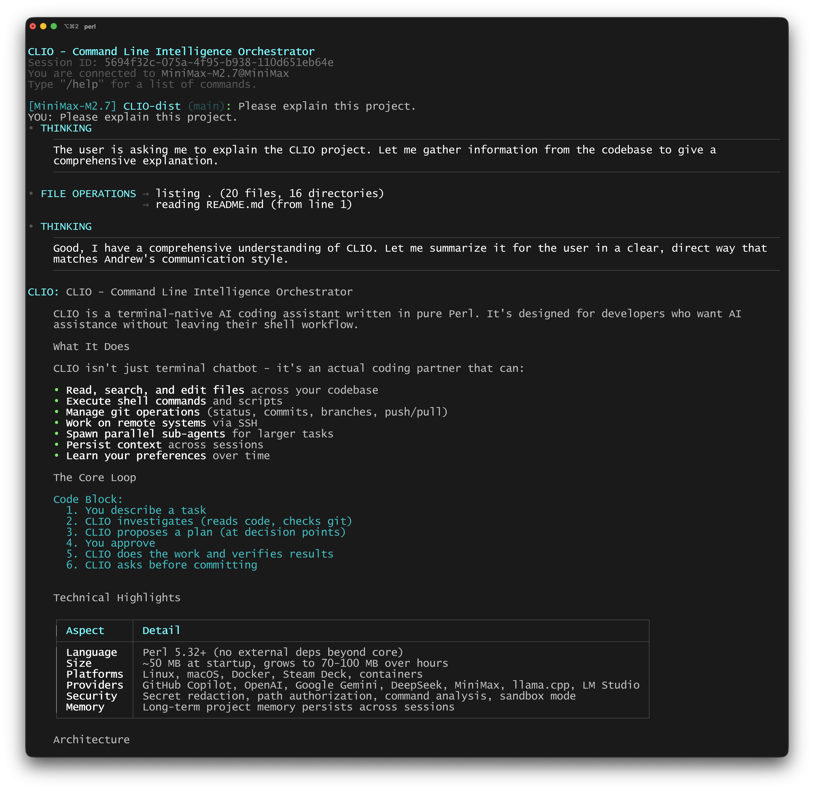
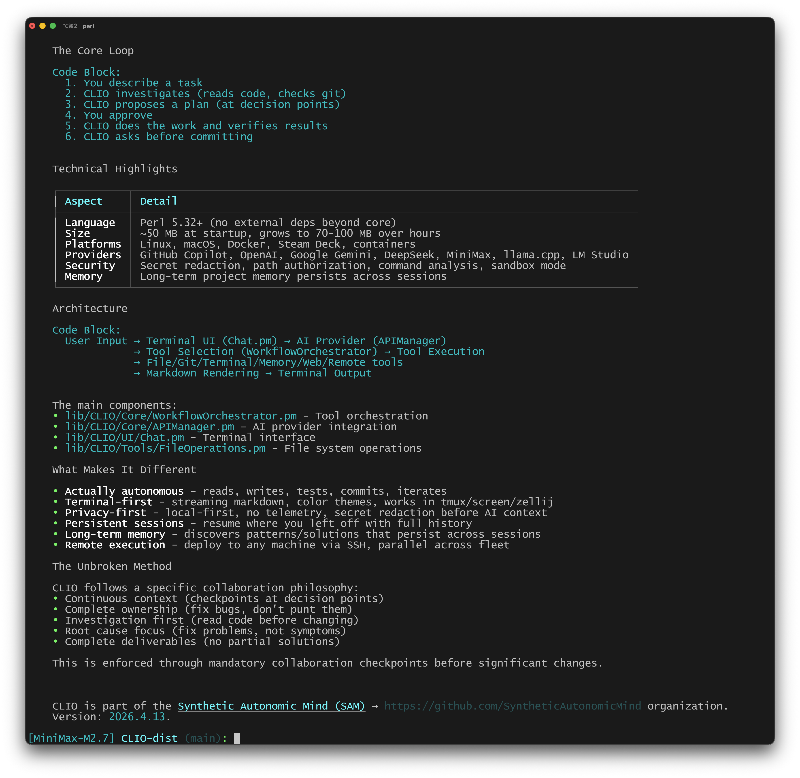

# CLIO

**A terminal-native AI development agent and extensible agent harness. The model does the reasoning - CLIO provides the tools, context, session state, and recovery.**

I built CLIO for myself. I spend more time in terminal sessions than I do using GUIs, and I wanted an AI coding tool that worked the way I work. It didn't really exist, so I built it. Starting with v20260119.1, CLIO has been building itself - all development on SAM, CLIO, and ALICE happens through pair programming with CLIO.

[](LICENSE) [](docs/DEPENDENCIES.md) [](https://github.com/orgs/SyntheticAutonomicMind/discussions)

---

Give CLIO a task and it works through it end to end - investigates your codebase, proposes a plan, implements after your approval, runs tests, and commits. It reads your code, edits files across multiple modules, searches with understanding, and runs shell commands. You can interrupt it mid-task with any keypress and it picks up where you left off next session.

CLIO is a Perl-based agent harness that works anywhere Perl runs. No CPAN, no pip, no npm - just core Perl and standard Unix tools. It supports 20 AI providers including GitHub Copilot, OpenAI, Anthropic, Google Gemini, DeepSeek, OpenRouter, MiniMax, Z.AI, NVIDIA NIM, Opper, and local models via llama.cpp or LM Studio. You can also point it at any OpenAI-compatible endpoint.

For the full architecture overview - the six-layer security model, memory system, multi-agent coordination, and how all the pieces fit together - the [website has a thorough writeup](https://www.syntheticautonomicmind.org/docs/CLIO/index.html). This README gets you running.

---

## What It Actually Does

Here's the concrete list - things that happen when you use CLIO:

- **Investigates before modifying.** CLIO searches your codebase, reads files, and builds understanding before proposing changes. It doesn't guess.
- **Edits files with undo.** Changes are written through `file_operations` with path authorization. Every edit is backed up - `/undo` reverts any turn, not just the last one.
- **Runs tests and git.** It commits, branches, stashes, and pushes. Test failures get fed back in for another iteration.
- **Remembers across sessions.** CLIO stores discoveries, solutions, and code patterns in long-term memory. The next session on the same project starts with what was learned last time.
- **Coordinates parallel work.** Spawn sub-agents with file and git locks so multiple agents can work on the same repo without stepping on each other. They communicate over a Unix socket message bus.
- **Runs across your fleet.** SSH into any machine, deploy CLIO, run a task, get results back in your local session. Or deploy across your entire fleet in parallel.
- **Integrates with terminals.** Live agent output in tmux, GNU Screen, or Zelli panes. Auto-detected - works without them too.
- **Stays private by design.** Secret redaction strips API keys, tokens, and passwords from AI context before they reach the model. File access outside the project directory needs your approval. Invisible Unicode characters that could hide prompt injections are filtered automatically.
- **Sandboxes when needed.** `--sandbox` blocks web, remote, and agent access and restricts file operations to the project directory. For true isolation, `clio-container` runs CLIO in Docker with `--cap-drop ALL`.
- **Builds itself.** CLIO has been maintaining its own codebase, ALICE, and SAM through AI-assisted development since v20260119.1.

### Tools Available by Default

CLIO exposes 9 tools to the model. Three more load conditionally based on config. MCP and plugin tools load dynamically.

| Tool | What It Does |
|---|---|
| `file_operations` | Read, write, search, edit, delete, rename, list directories, grep, semantic search |
| `version_control` | Full git: status, diff, log, commit, branch, push, pull, stash, tag, worktree, blame |
| `terminal_operations` | Shell execution with fork+process-group isolation and risk classification |
| `memory_operations` | Store/retrieve key-value state, LTM patterns, session recall |
| `web_operations` | Fetch URLs, web search |
| `todo_operations` | Create, update, complete, list multi-step tasks |
| `code_intelligence` | Symbol search (list_usages), semantic git commit search (search_history) |
| `interact` | Checkpoint prompts - pause the agent loop to ask for your input |
| `apply_patch` | Apply lightweight diff patches |

Conditional: `remote_execution`, `agent_operations`, `skill_operations`.

### AI Providers

20 providers are configured in `lib/CLIO/Providers.pm`. Anthropic, Google, and NVIDIA use native protocol adapters - everything else is OpenAI-compatible or Copilot format.

| Provider | Auth | Notes |
|---|---|---|
| GitHub Copilot | OAuth | Access to GPT-4, Claude, o1/o3, MiniMax |
| OpenAI | API Key | GPT-5, o1/o3, GPT-4o |
| Anthropic | API Key | Claude via native Messages API |
| Google Gemini | API Key | Gemini 2.5 Pro/Flash |
| DeepSeek | API Key | DeepSeek V4 |
| OpenRouter | API Key | 100+ models, automatic fallback |
| Ollama Cloud | API Key | Cloud-hosted Ollama |
| MiniMax | API Key | MiniMax-M3 |
| MiniMax Token Plan | API Key | Token-plan billing variant |
| Z.AI (Chat) | API Key | GLM models |
| Z.AI (Coding) | API Key | GLM coding-optimized |
| NVIDIA NIM | API Key | Nemotron models |
| Vercel AI Gateway | API Key | Vercel's managed gateway |
| OrcaRouter | API Key | Auto-routing across upstreams |
| KiloCode | API Key | Auto-rotating free models |
| Opper | API Key | Most recent addition |
| Charm Hyper | API Key | HyperCharm gateway |
| SAM | API Key | Use your local SAM instance |
| llama.cpp | None | Local |
| LM Studio | None | Local |

Run `/api models` after setup to see current model availability. Full setup instructions in [docs/PROVIDERS.md](docs/PROVIDERS.md).

---

## Quick Start

```bash
# Check you have the essentials
./check-deps

# Install (macOS)
brew tap SyntheticAutonomicMind/homebrew-SAM && brew install clio

# Or install manually
git clone https://github.com/SyntheticAutonomicMind/CLIO.git
cd CLIO && sudo ./install.sh

# Or run in Docker (no local Perl needed)
docker run -it --rm -v "$(pwd)":/workspace -v clio-auth:/root/.clio \
  -w /workspace ghcr.io/syntheticautonomicmind/clio:latest --new
```

Then configure a provider - GitHub Copilot is the fastest path:

```bash
clio --new
: /api login
# Browser opens, you authorize, done
```

Or set an API key:

```bash
clio --new
: /api set provider openai
: /api set key YOUR_API_KEY
: /config save
```

Then give it a real task:

```text
Find the bug causing the authentication failure, fix it, add a regression
test, run the relevant tests, and show me the resulting diff.
```

Or just start a conversation:

```bash
clio --new
```

### Useful Commands

```bash
clio --new                    # Start a new session
clio --resume                 # Resume last session
clio --debug                  # Debug mode
clio --sandbox                # Restrict to project directory only
clio --enable file_operations # Allowlist specific tools
clio --disable web_operations # Block specific tools
```

CLIO requires Perl 5.32+ and standard Unix tools (git, curl, stty, tput, tar). All Perl modules are core - no external dependencies. See [docs/DEPENDENCIES.md](docs/DEPENDENCIES.md) and [docs/INSTALLATION.md](docs/INSTALLATION.md) for details.

---

## Privacy and Security

CLIO is local-first and provider-independent. With local model backends, model interaction can stay on your hardware. When you select a hosted provider, the context required for that provider is sent to that provider.

Defense in depth - these layers apply regardless of provider:

- **Secret redaction** - API keys, tokens, passwords, and PII are stripped from AI context before it reaches the model
- **Command analysis** - shell commands are classified by risk level (network, credential access, destructive) and require your approval for high-risk operations
- **Path authorization** - file access outside the project directory needs your permission
- **Invisible character filtering** - Unicode prompt injection is blocked automatically
- **Sandbox mode** - `--sandbox` blocks web, remote, and agent access, restricts files to the project directory
- **Container isolation** - `clio-container` runs CLIO inside Docker with dropped capabilities

See [docs/SECURITY.md](docs/SECURITY.md) and [docs/SANDBOX.md](docs/SANDBOX.md).

---

## Screenshots

<table>
  <tr>
    <td width="50%">
      <h3>CLIO investigating a repository, showing live tool execution</h3>
      <a href="https://raw.githubusercontent.com/SyntheticAutonomicMind/CLIO/main/.images/clio1.png">
        
      </a>
    </td>
    <td width="50%">
      <h3>Multi-provider model configuration with thinking modes</h3>
      <a href="https://raw.githubusercontent.com/SyntheticAutonomicMind/CLIO/main/.images/clio2.png">
        
      </a>
    </td>
  </tr>
</table>

---

## Documentation

The [website docs](https://www.syntheticautonomicmind.org/docs/CLIO/index.html) cover the user guide, architecture, security model, and methodology. In-repo docs:

- [User Guide](docs/USER_GUIDE.md) - complete usage and slash commands
- [Architecture](docs/ARCHITECTURE.md) - system design and internals
- [Memory](docs/MEMORY.md) - how sessions, LTM, and recovery work
- [Providers](docs/PROVIDERS.md) - AI provider setup
- [Sandbox Mode](docs/SANDBOX.md) - isolation options
- [Security](docs/SECURITY.md) - full security model
- [Remote Execution](docs/REMOTE_EXECUTION.md) - fleet deployment
- [Multi-Agent](docs/MULTI_AGENT_COORDINATION.md) - parallel agent coordination
- [MCP Integration](docs/MCP.md) - Model Context Protocol support
- [Skills](docs/FEATURES.md#11-skills-system) - custom skill management
- [OpenSpec](docs/PUPPETEER_MODE.md) - spec-driven development
- [Developer Guide](docs/DEVELOPER_GUIDE.md) - contributing

---

CLIO is part of [Synthetic Autonomic Mind](https://github.com/SyntheticAutonomicMind). GPL-3.0-only for code, CC-BY-NC-SA-4.0 for documentation. Created by Andrew Wyatt (fewtarius).

[Website](https://www.syntheticautonomicmind.org) | [GitHub](https://github.com/SyntheticAutonomicMind/CLIO) | [Discussions](https://github.com/orgs/SyntheticAutonomicMind/discussions)
