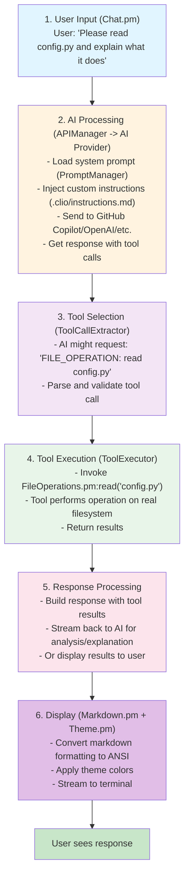
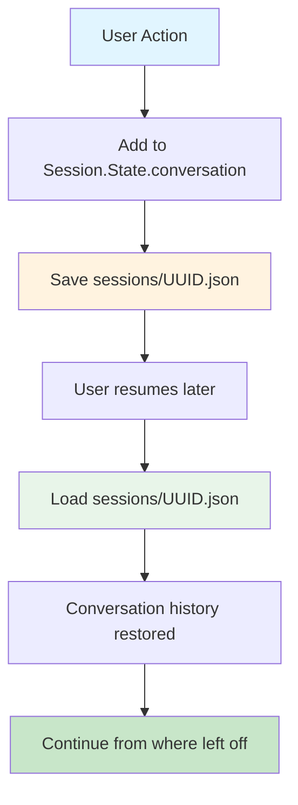
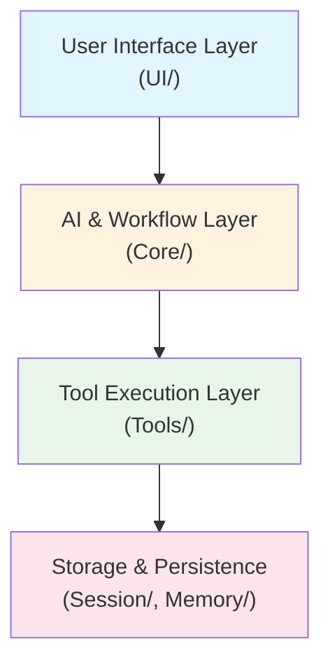

# CLIO Architecture

**Last Updated:** February 2026

---------------------------------------------------

## Quick Overview

CLIO is a **terminal-first AI code assistant** built in Perl. It integrates AI models (GitHub Copilot, OpenAI, etc.) with local tools (file operations, git, terminal) to help developers work more effectively.

**Core concept:** User types → CLIO thinks → CLIO uses tools → Results displayed

```
User Input
   ↓
Terminal UI (Chat.pm)
   ↓
AI Agent (SimpleAIAgent.pm)
   ↓
Tool Selection & Execution
     - File Operations (FileOperations.pm)
     - Git (VersionControl.pm)
     - Terminal (TerminalOperations.pm)
     - Memory (MemoryOperations.pm)
     - Other tools...
   ↓
Response Processing
   ↓
Markdown Rendering (Markdown.pm)
   ↓
Terminal Output
```

---------------------------------------------------

## System Components

### 1. User Interface Layer
**Files:** `lib/CLIO/UI/`

| Component | File | Purpose |
|-----------------------------------------------------------------------------------------------------------------------------------------------------------|------------------------------------------------------------------------------------------------------|---------------------------------------------------------------------------------------------------------------------------------------------------------|
| Terminal UI | `Chat.pm` | Main interaction loop, streaming output |
| Markdown Renderer | `Markdown.pm` | Convert markdown to ANSI |
| Color/ANSI | `ANSI.pm` | ANSI escape sequences |
| Themes | `Theme.pm` | Color themes and styling |

**How it works:**
1. User types message
2. Chat.pm sends to AI
3. Stream responses back to terminal
4. Markdown rendering converts formatting
5. Apply theme colors

### 2. Core AI & Workflow
**Files:** `lib/CLIO/Core/`

| Component | File | Purpose |
|-----------------------------------------------------------------------------------------------------------------------------------------------------------|------------------------------------------------------------------------------------------------------|---------------------------------------------------------------------------------------------------------------------------------------------------------|
| API Manager | `APIManager.pm` | AI provider integration |
| Simple AI Agent | `SimpleAIAgent.pm` | Handles AI requests/responses |
| Workflow Orchestrator | `WorkflowOrchestrator.pm` | Complex multi-step workflows |
| Task Orchestrator | `TaskOrchestrator.pm` | Task management and orchestration |
| Tool Executor | `ToolExecutor.pm` | Invokes tools |
| Tool Call Extractor | `ToolCallExtractor.pm` | Extract tool calls from AI responses |
| Prompt Manager | `PromptManager.pm` | System prompts + custom instructions |
| Instructions Reader | `InstructionsReader.pm` | Reads `.clio/instructions.md` |
| Protocol Integration | `ProtocolIntegration.pm` | Integrate protocol handlers |
| Config | `Config.pm` | API keys, provider selection |
| ReadLine | `ReadLine.pm` | Command history & editing |
| Command Parser | `CommandParser.pm` | Parse user commands |
| Editor | `Editor.pm` | Core editing functionality |
| Hashtag Parser | `HashtagParser.pm` | Parse hashtag commands |
| Tab Completion | `TabCompletion.pm` | Tab completion support |
| Skill Manager | `SkillManager.pm` | Manage AI skills |
| GitHub Auth | `GitHubAuth.pm` | GitHub OAuth authentication |
| GitHub Copilot Models API | `GitHubCopilotModelsAPI.pm` | Access GitHub Copilot models |
| Performance Monitor | `PerformanceMonitor.pm` | Track performance metrics |
| Logger | `Logger.pm` | Debug and trace output |

**How it works:**
1. APIManager connects to AI provider (GitHub Copilot, OpenAI, etc.)
2. WorkflowOrchestrator manages complex interactions
3. PromptManager provides system prompt + custom instructions
4. ToolExecutor invokes selected tools
5. Results processed and returned

### 3. Tool System
**Files:** `lib/CLIO/Tools/`

| Tool | File | Operations |
|------------------------------------------------------------------------------------------------------|------------------------------------------------------------------------------------------------------|------------------------------------------------------------------------------------------------------------------------------------------------------------------------------------------------------------|
| File Operations | `FileOperations.pm` | read, write, search, create, delete, rename, etc. |
| Version Control | `VersionControl.pm` | git status, log, diff, commit, branch, push, pull |
| Terminal | `TerminalOperations.pm` | exec - run shell commands |
| Memory | `MemoryOperations.pm` | store, retrieve, search, list, delete |
| Todo | `TodoList.pm` | create, update, complete, list, track tasks |
| Code Intelligence | `CodeIntelligence.pm` | list_usages, search_history |
| Web | `WebOperations.pm` | fetch_url, search_web |
| User Collaboration | `UserCollaboration.pm` | request_input - checkpoint prompts |
| Sub-Agent Operations | `SubAgentOperations.pm` | Spawn and manage parallel agents |
| Remote Execution | `RemoteExecution.pm` | Execute AI tasks on remote systems |
| Apply Patch | `ApplyPatch.pm` | Apply lightweight diff patches |
| MCP Bridge | `MCPBridge.pm` | Bridge to MCP tool servers |
| Base Tool | `Tool.pm` | Abstract base class for all tools |
| Registry | `Registry.pm` | Tool registration and lookup |

**Architecture:**
- Base class: `Tool.pm` provides abstract interface
- Each tool extends Tool.pm and implements execute()
- `Registry.pm` maintains tool registry and handles lookup
- `ToolExecutor.pm` (in Core) invokes tools and manages execution
- `ToolResultStore.pm` (in Session) caches large tool outputs for efficiency

### 4. Session Management
**Files:** `lib/CLIO/Session/`

| Component | File | Purpose |
|-----------------------------------------------------------------------------------------------------------------------------------------------------------|------------------------------------------------------------------------------------------------------|---------------------------------------------------------------------------------------------------------------------------------------------------------|
| Session Manager | `Manager.pm` | Create/load/resume sessions |
| Session State | `State.pm` | Conversation history, metadata |
| Todo Store | `TodoStore.pm` | Persist todos across sessions |
| Tool Result Store | `ToolResultStore.pm` | Cache tool results for large output |

**How it works:**
1. New session: Create `sessions/UUID.json`
2. Each message appended to conversation history
3. Sessions persist on disk (in `sessions/` directory)
4. Resume: Load session from disk, continue conversation

### 5. Memory System
**Files:** `lib/CLIO/Memory/`

| Component | File | Purpose |
|-----------------------------------------------------------------------------------------------------------------------------------------------------------|------------------------------------------------------------------------------------------------------|---------------------------------------------------------------------------------------------------------------------------------------------------------|
| Short-Term | `ShortTerm.pm` | Session context |
| Long-Term | `LongTerm.pm` | Persistent storage |
| YaRN | `YaRN.pm` | Conversation threading |
| Token Estimator | `TokenEstimator.pm` | Count tokens for context |

**How it works:**
- Short-term memory maintains current session context
- Long-term memory provides persistent storage across sessions
- YaRN manages conversation threading and context windows
- Token estimator prevents context overflow

### 6. Code Analysis
**Files:** `lib/CLIO/Code/`

| Component | File | Purpose |
|-----------------------------------------------------------------------------------------------------------------------------------------------------------|------------------------------------------------------------------------------------------------------|---------------------------------------------------------------------------------------------------------------------------------------------------------|
| Tree-sitter | `TreeSitter.pm` | Parse code into AST |
| Symbols | `Symbols.pm` | Extract function/class names |
| Relations | `Relations.pm` | Map symbol relationships |

**How it works:**
- TreeSitter parses source code into abstract syntax trees
- Symbols extracts function/class/variable definitions
- Relations maps dependencies and call graphs

### 7. Security
**Files:** `lib/CLIO/Security/`

| Component | File | Purpose |
|-----------------------------------------------------------------------------------------------------------------------------------------------------------|------------------------------------------------------------------------------------------------------|---------------------------------------------------------------------------------------------------------------------------------------------------------|
| Auth | `Auth.pm` | GitHub OAuth, token storage |
| Authz | `Authz.pm` | Check file access permissions |
| Path Authorizer | `PathAuthorizer.pm` | Control file access |
| Manager | `Manager.pm` | Overall security |

**How it works:**
1. User runs `/login` → GitHub device flow
2. Token stored securely in `~/.clio/`
3. File operations check PathAuthorizer
4. Audit logging of all operations

### 8. Logging & Monitoring
**Files:** `lib/CLIO/Logging/`, `lib/CLIO/Core/`

| Component | File | Purpose |
|-----------------------------------------------------------------------------------------------------------------------------------------------------------|------------------------------------------------------------------------------------------------------|---------------------------------------------------------------------------------------------------------------------------------------------------------|
| Logger | `Core/Logger.pm` | Debug/trace output |
| Tool Logger | `Logging/ToolLogger.pm` | Log tool operations |
| Performance Monitor | `Core/PerformanceMonitor.pm` | Track timing |

**How it works:**
- Debug mode: `clio --debug`
- Output goes to STDERR with `[DEBUG]`, `[ERROR]`, `[TRACE]` prefixes
- Tool operations logged via ToolLogger

### 9. Protocol System
**Files:** `lib/CLIO/Protocols/`

| Protocol | File | Purpose |
|----------------------------------------------------------------------------------------------------------------------------------------------------------|------------------------------------------------------------------------------------------------------|---------------------------------------------------------------------------------------------------------------------------------------------------------|
| Architect | `Architect.pm` | Problem-solving design |
| Editor | `Editor.pm` | Code modification format |
| Validate | `Validate.pm` | Code validation |
| RepoMap | `RepoMap.pm` | Repository mapping |
| Recall | `Recall.pm` | Memory recall |
| RemoteDistribution | `RemoteDistribution.pm` | Remote task distribution |
| Handler | `Handler.pm` | Protocol base class |
| Manager | `Manager.pm` | Protocol registry |

**How it works:**
1. AI returns natural language protocol commands
2. ProtocolIntegration.pm parses them
3. Manager looks up protocol handler
4. Handler executes the protocol
5. Results sent back to AI

---------------------------------------------------

## Data Flow

### Typical Interaction



### Session Persistence



---------------------------------------------------

## Entry Points

### `clio` Script (Main Executable)
```perl
#!/usr/bin/env perl
1. Load required modules
2. Parse command-line arguments (--new, --resume, --debug, etc.)
3. Initialize configuration
4. Create/load session
5. Instantiate Chat.pm UI
6. Start interactive loop
```

### `clio --new`
- Start fresh session
- Create new `sessions/UUID.json`
- Begin conversation

### `clio --resume`
- Find most recent session
- Load conversation history
- Resume from where left off

### `clio --input "text" --exit`
- Non-interactive mode
- Process input and exit immediately
- Used for scripting/automation

---------------------------------------------------

## Configuration

### Locations
- **API Keys:** `~/.clio/config.json`
- **Sessions:** `./sessions/` (project directory)
- **Custom Instructions:** `./.clio/instructions.md` (project directory)
- **System Prompts:** `~/.clio/system-prompts/` (user home)

### Setup Process
```bash
clio --new           # First run
: /login            # Authorize with GitHub Copilot
: /config show      # View config
: /api provider     # Check current provider
```

---------------------------------------------------

## Dependencies

### Required (Perl Core Only)
- `strict`, `warnings` (language features)
- `JSON::PP` (JSON parsing, core since 5.14)
- `HTTP::Tiny` (HTTP requests, core since 5.14)
- `MIME::Base64` (base64 encoding, core since 5.8)
- `Digest::SHA` (SHA hashing, core since 5.10)
- `File::Spec` (cross-platform paths, core)
- `File::Path` (directory operations, core)
- `File::Temp` (temporary files, core)
- `File::Find` (file tree traversal, core)
- `File::Basename` (path manipulation, core)
- `Time::HiRes` (high-resolution timers, core since 5.8)
- `POSIX` (POSIX functions, core)
- `Cwd` (working directory, core)
- Plus other core modules

### Optional (Non-Core, Graceful Degradation)
- `Text::Diff` (diff visualization - has fallback if not installed)

### External Tools Required
- System `git` (for version control operations)
- System `perl` 5.32+ (for script execution)

### NOT Used
- ❌ CPAN modules (except optional Text::Diff with fallback)
- ❌ External npm/pip packages  
- ❌ Build tools like Make or Gradle
- ❌ Term::ReadLine (not required, uses basic readline if missing)

---------------------------------------------------

## Testing

### Test Framework
- `lib/CLIO/Test/Framework.pm` - Test utilities
- `tests/run_all_tests.pl` - Test runner
- `tests/**/*.t` - Individual test files

### Current Coverage
- ✅ Encoding tests: 171/171 PASS
- ✅ CLI tests: 9/9 PASS
- ⚠️ Tool operations: Basic coverage
- ⚠️ Integration: Spot checks only

### Run Tests
```bash
./tests/run_all_tests.pl --all
```

---------------------------------------------------

## Performance Considerations

### Speed
- Direct tool invocation (no remote API for file ops)
- Streaming responses from AI (no wait for full response)
- Token counting for efficient context usage

### Memory
- Session data in `sessions/` (JSON files)
- In-memory conversation history
- Token estimator helps avoid OOM

### Scalability
- Not designed for 1000s of projects
- Designed for individual developer workflows
- Can handle large codebases (>1GB)

---------------------------------------------------

## Architectural Considerations

### Design Principles
1. **Modularity** - Each component has a single, well-defined responsibility
2. **Extensibility** - Tools and protocols can be added without modifying core
3. **Separation of Concerns** - UI, AI, tools, and storage are independent layers
4. **Graceful Degradation** - Optional features fail safely (e.g., Text::Diff)

### Extension Points
- **Tools**: Create new tool in `lib/CLIO/Tools/`, register in Registry
- **Protocols**: Create protocol handler in `lib/CLIO/Protocols/`, extend Handler.pm
- **UI Themes**: Add theme file in `themes/`, define color scheme
- **AI Providers**: Add provider logic in Core/APIManager.pm

---------------------------------------------------

## Module Organization

```
lib/CLIO/
  Providers.pm             # AI provider registry (SAM, GitHub Copilot, etc.)
  Update.pm                # Self-update system
  UI/                      # Terminal interface
      Chat.pm              # Main interactive loop
      Markdown.pm          # Markdown to ANSI
      ANSI.pm              # Color codes
      Theme.pm             # Color themes
      Display.pm           # Display utilities
      ToolOutputFormatter.pm # Tool output formatting
      CommandHandler.pm    # Slash command routing
      ProgressSpinner.pm   # Progress indicators
      Commands/            # Slash command handlers (AI, API, Config, etc.)
  Core/                    # Core AI functionality
      APIManager.pm        # AI provider integration
      SimpleAIAgent.pm     # AI request/response
      PromptManager.pm     # System prompts
      PromptBuilder.pm     # Prompt construction
      InstructionsReader.pm # Custom instructions
      WorkflowOrchestrator.pm # Multi-step workflows
      TaskOrchestrator.pm  # Task orchestration
      ToolExecutor.pm      # Tool invocation
      ToolCallExtractor.pm # Extract tool calls
      ToolErrorGuidance.pm # Tool error assistance
      ProtocolIntegration.pm # Protocol integration
      ConversationManager.pm # Conversation management
      Config.pm            # Configuration
      ModelRegistry.pm     # Model management
      ReadLine.pm          # Command history
      CommandParser.pm     # Command parsing
      Editor.pm            # Core editing
      HashtagParser.pm     # Hashtag commands
      TabCompletion.pm     # Tab completion
      SkillManager.pm      # AI skills
      GitHubAuth.pm        # OAuth
      GitHubCopilotModelsAPI.pm # Copilot models
      CopilotUserAPI.pm    # Copilot user API
      DeviceRegistry.pm    # Device management
      AgentLoop.pm         # Persistent agent loop
      PerformanceMonitor.pm # Performance tracking
      Logger.pm            # Logging
  Tools/                   # Tool implementations
      Tool.pm              # Base class
      Registry.pm          # Tool registry
      FileOperations.pm    # File I/O (18 operations)
      VersionControl.pm    # Git (10 operations)
      TerminalOperations.pm # Shell execution
      MemoryOperations.pm  # Memory operations
      TodoList.pm          # Todo tracking
      CodeIntelligence.pm  # Code analysis
      UserCollaboration.pm # User checkpoints
      SubAgentOperations.pm # Multi-agent management
      RemoteExecution.pm   # Remote SSH execution
      ApplyPatch.pm        # Patch application
      MCPBridge.pm         # MCP tool bridge
      WebOperations.pm     # Web operations
  Session/                 # Session management
      Manager.pm           # Session CRUD
      State.pm             # Conversation state
      TodoStore.pm         # Todo persistence
      ToolResultStore.pm   # Large result storage
      Snapshot.pm          # Session snapshots
      Export.pm            # Session export
      Lock.pm              # Session locking
  Memory/                  # Memory systems
      ShortTerm.pm         # Session context
      LongTerm.pm          # Persistent storage
      YaRN.pm              # Context windowing
      TokenEstimator.pm    # Token counting
  Code/                    # Code analysis
      TreeSitter.pm        # AST parsing
      Symbols.pm           # Symbol extraction
      Relations.pm         # Symbol relationships
  Coordination/            # Multi-agent coordination
      Broker.pm            # Coordination server
      Client.pm            # Broker connection API
      SubAgent.pm          # Process spawning
  Protocols/               # Protocol handlers
      Manager.pm           # Protocol registry
      Handler.pm           # Base class
      Architect.pm         # Design protocol
      Editor.pm            # Code editing protocol
      Validate.pm          # Validation protocol
      RepoMap.pm           # Repository mapping
      Recall.pm            # Memory recall
      RemoteDistribution.pm # Remote task distribution
  Providers/               # Native API provider modules
      Base.pm              # Provider base class
      Anthropic.pm         # Anthropic native API
      Google.pm            # Google Gemini native API
  MCP/                     # Model Context Protocol
      Manager.pm           # MCP server management
      Client.pm            # MCP JSON-RPC client
      Auth/OAuth.pm        # MCP OAuth support
      Transport/Stdio.pm   # Stdio transport
      Transport/HTTP.pm    # HTTP/SSE transport
  Security/                # Security & auth
      Auth.pm              # OAuth
      Authz.pm             # Authorization
      PathAuthorizer.pm    # File access control
      SecretRedactor.pm    # PII/secret redaction
      Manager.pm           # Security manager
  Logging/                 # Logging system
      ToolLogger.pm        # Tool operation logging
      ProcessStats.pm      # Process statistics
  NaturalLanguage/         # NLP processing
      TaskProcessor.pm     # Natural language task processing
  Compat/                  # Compatibility layers
      HTTP.pm              # HTTP compatibility
      Terminal.pm          # Terminal compatibility
  Util/                    # Utilities
      PathResolver.pm      # Path resolution
      TextSanitizer.pm     # Text sanitization
      JSONRepair.pm        # JSON repair
      JSON.pm              # JSON module selection
      ConfigPath.pm        # Config path resolution
      InputHelpers.pm      # Input helpers
      AnthropicXMLParser.pm # Anthropic XML parsing
  Test/                    # Testing framework
      Framework.pm         # Test utilities
  Util/                    # Utility modules
      PathResolver.pm      # Path resolution
      TextSanitizer.pm     # Text sanitization
      ... (other utilities)
  NaturalLanguage/         # NL processing
      ... (NL modules)
  Compat/                  # Compatibility layer
      ... (compatibility modules)
```

---------------------------------------------------

## For Developers

### Getting Started
1. **Read:** `docs/CUSTOM_INSTRUCTIONS.md` - How projects customize CLIO
2. **Read:** `docs/DEVELOPER_GUIDE.md` - Development guide and conventions
3. **Explore:** Individual module POD docs

### Understanding Code
- Start with `clio` script entry point
- Follow to `Chat.pm` for UI loop
- Check `SimpleAIAgent.pm` for AI agent logic
- See `WorkflowOrchestrator.pm` for tool orchestration
- See `ToolExecutor.pm` for tool invocation

### Adding Features
1. Implement in appropriate module
2. Add tests in `tests/`
3. Run `perl -I./lib -c` on all changed modules
4. Test with `./clio --debug --input "test" --exit`
5. Update relevant docs

### Common Tasks
- **Fix bug:** Find module → Read code → Fix → Test → Commit
- **Add tool:** Create `lib/CLIO/Tools/MyTool.pm` → Register in main script
- **Add protocol:** Create `lib/CLIO/Protocols/MyProtocol.pm` → Register in Manager
- **Update UI:** Modify `lib/CLIO/UI/Chat.pm` or `Theme.pm`

---------------------------------------------------

## Summary

CLIO follows a **layered architecture** with clear separation of concerns:

**Key Architectural Features:**
- **Plugin-based tool system** - Tools register dynamically
- **Protocol-driven AI interaction** - Structured AI communication
- **Persistent session state** - Conversation history survives restarts
- **Zero external dependencies** - Runs with Perl core modules only
- **Modular design** - Each component can evolve independently

The architecture prioritizes **clarity, maintainability, and extensibility** - making it straightforward for developers to understand the codebase and add new capabilities.
