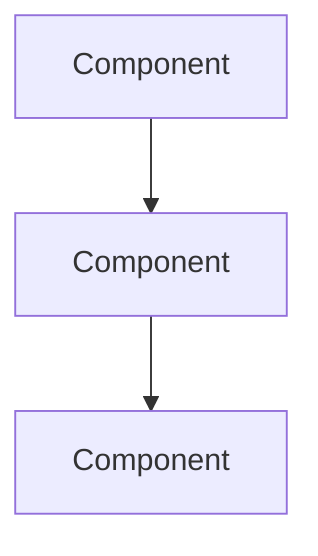
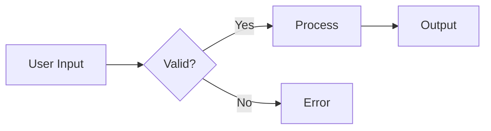
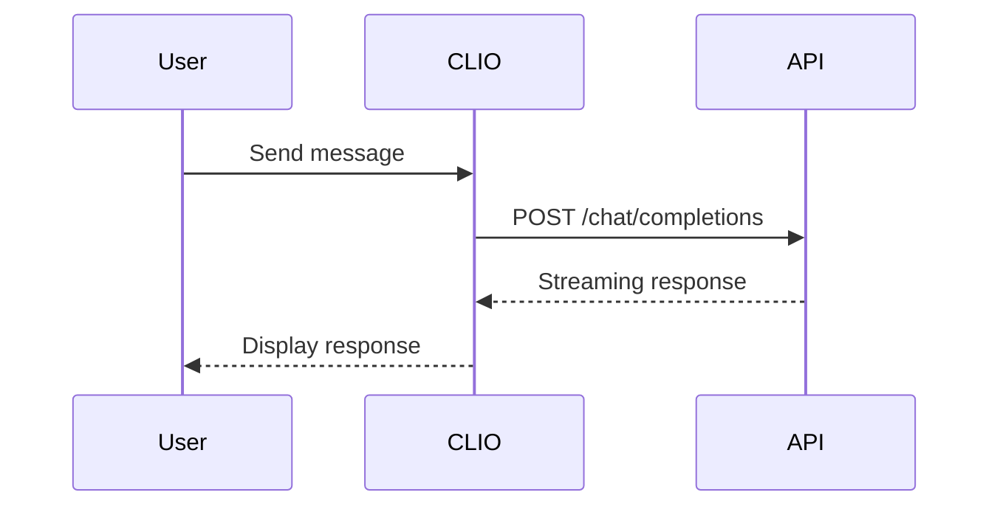
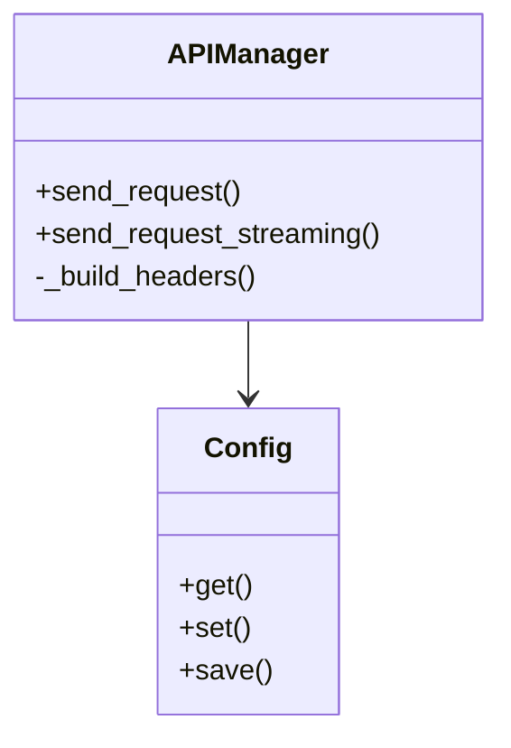

# CLIO Developer Documentation Style Guide

**For technical documentation: module POD, inline comments, API docs, specifications**

━━━━━━━━━━━━━━━━━━━━━━━━━━━━━━━━━━━━━━━━━━━━━━━━━━━━━━━━━━━━

## Purpose

This guide defines documentation standards for CLIO developers. Well-documented code is maintainable code. Follow these standards to ensure consistency across the codebase.

━━━━━━━━━━━━━━━━━━━━━━━━━━━━━━━━━━━━━━━━━━━━━━━━━━━━━━━━━━━━

## Module Documentation (POD)

### Module Header Template

Every Perl module must start with POD documentation:

```perl
package CLIO::Core::APIManager;

use strict;
use warnings;

=head1 NAME

CLIO::Core::APIManager - Manages API requests and responses for AI providers

=head1 SYNOPSIS

    use CLIO::Core::APIManager;
    
    my $api = CLIO::Core::APIManager->new(
        config => $config,
        debug => 1
    );
    
    my $response = $api->send_request(
        messages => \@messages,
        tools => \@tools
    );

=head1 DESCRIPTION

APIManager handles all communication with AI provider APIs. It manages:

- Request construction and parameter validation
- Authentication and header management
- Streaming and non-streaming responses
- Error handling and retry logic
- Rate limiting and request throttling

This module supports multiple AI providers (GitHub Copilot, OpenAI, SAM, etc.)
and automatically handles provider-specific quirks like billing continuity
and endpoint variations.

=head1 METHODS

=cut
```

**Required Sections:**
- `NAME` - Module name and one-line description
- `SYNOPSIS` - Complete working example of typical usage
- `DESCRIPTION` - Detailed explanation of module purpose and capabilities
- `METHODS` - Document each public method (see below)

**Optional Sections:**
- `ATTRIBUTES` - Document object properties
- `CONSTRUCTOR` - Document new() if non-standard
- `DEPENDENCIES` - List required modules
- `SEE ALSO` - Related modules
- `AUTHOR` - Author information
- `LICENSE` - License information

### Method Documentation Template

Document every public method:

```perl
=head2 send_request

Sends a non-streaming request to the configured AI provider.

Arguments:
    messages => \@messages  # Array of message hashes (required)
    tools    => \@tools     # Array of tool definitions (optional)
    model    => $model      # Override default model (optional)

Returns:
    Hashref with structure:
    {
        success => 1|0,
        response => $text,      # AI response text
        tool_calls => \@calls,  # Tool invocations (if any)
        error => $message       # Error message (if failed)
    }

Example:
    my $result = $api->send_request(
        messages => [
            { role => 'user', content => 'Explain this code' }
        ]
    );
    
    if ($result->{success}) {
        print $result->{response};
    } else {
        warn "Error: $result->{error}";
    }

Throws:
    Dies if config is invalid or provider is unreachable

=cut

sub send_request {
    my ($self, %args) = @_;
    # Implementation...
}
```

**Method Documentation Must Include:**
- Brief description of what the method does
- Arguments: name, type, description, required/optional
- Return value: structure and meaning
- Example: complete working example
- Exceptions: what errors it throws/returns

### Internal Methods

Mark internal methods (not part of public API) with underscore prefix:

```perl
=head2 _build_headers (Internal)

Constructs HTTP headers for API requests. Internal method - do not call directly.

Arguments:
    provider => $provider  # Provider name (required)

Returns:
    Hashref of HTTP headers

=cut

sub _build_headers {
    my ($self, %args) = @_;
    # Implementation...
}
```

━━━━━━━━━━━━━━━━━━━━━━━━━━━━━━━━━━━━━━━━━━━━━━━━━━━━━━━━━━━━

## Code Comments

### When to Comment

**DO comment:**
- Complex algorithms or logic
- Non-obvious decisions or workarounds
- Business rules or requirements
- Important limitations or gotchas
- Regex patterns (explain what they match)

**DON'T comment:**
- Obvious code (redundant comments are noise)
- Every single line (trust the reader)
- What the code does (the code shows that)
- Outdated information (remove old comments)

### Comment Style

**Block comments** for explanations:

```perl
# GitHub Copilot requires statefulMarker to maintain billing continuity.
# Without this, every request charges premium quota even for same conversation.
# Store the response ID and include it in next request as previous_response_id.
if ($response_id) {
    $session->{last_github_copilot_response_id} = $response_id;
}
```

**Inline comments** for clarification:

```perl
my $retry_after = $response->header('Retry-After') || 60;  # Default 60s if header missing
$self->{rate_limit_until} = time() + $retry_after;
```

**TODO comments** (only during active development):

```perl
# TODO: Add exponential backoff for rate limiting (issue #42)
```

**Remove TODO comments** before merging - create issues instead.

### Explain WHY, Not WHAT

❌ **Don't:**
```perl
# Set the provider to SAM
$config->set('provider', 'sam');
```

✅ **Do:**
```perl
# SAM requires sam_config parameter to bypass its own preprocessing
# which can interfere with CLIO's protocol detection
$config->set('provider', 'sam');
```

### Comment Tricky Code

If the code is clever, unusual, or works around a bug, explain it:

```perl
# Perl doesn't support sprintf %,d for comma formatting (unlike GNU printf)
# so we manually insert commas using regex:
sub _format_number {
    my ($num) = @_;
    $num =~ s/(\d)(?=(\d{3})+(?!\d))/$1,/g;
    return $num;
}
```

### Comment Regex Patterns

Always explain complex regex patterns:

```perl
# Match protocol format: [PROTOCOL:key1=value1:key2=value2]
# Groups: (1) protocol name, (2) parameter string
if ($command =~ /^\[([A-Z_]+):(.+)\]$/) {
    my ($protocol, $params_str) = ($1, $2);
    # ...
}
```

━━━━━━━━━━━━━━━━━━━━━━━━━━━━━━━━━━━━━━━━━━━━━━━━━━━━━━━━━━━━

## Inline Documentation Standards

### Variable Names Should Be Self-Documenting

❌ **Don't:**
```perl
my $x = $session->{last_github_copilot_response_id};  # Response ID
my $t = time();  # Current timestamp
```

✅ **Do:**
```perl
my $response_id = $session->{last_github_copilot_response_id};
my $current_time = time();
```

### Use Type Hints in Comments

Perl doesn't have type declarations, so use comments:

```perl
=head2 get_models

Returns available models for the configured provider.

Arguments:
    None

Returns:
    Arrayref of hashrefs, each with:
    {
        id => String,              # Model identifier
        name => String,            # Display name
        context_length => Integer, # Max tokens
        supports_tools => Boolean  # Tool calling support
    }

=cut

sub get_models {
    my ($self) = @_;
    # Implementation...
}
```

### Document Data Structures

When working with complex data structures, document their shape:

```perl
# Message structure for AI providers:
# {
#     role => 'user' | 'assistant' | 'system',
#     content => String,
#     tool_calls => [                          # Optional
#         {
#             id => String,
#             type => 'function',
#             function => {
#                 name => String,
#                 arguments => JSON String
#             }
#         }
#     ]
# }
my @messages = (
    { role => 'user', content => 'What is 2+2?' },
    { role => 'assistant', content => '4' }
);
```

━━━━━━━━━━━━━━━━━━━━━━━━━━━━━━━━━━━━━━━━━━━━━━━━━━━━━━━━━━━━

## API Documentation

### Document All Public Functions

Every function callable from outside the module must be documented:

```perl
=head2 execute

Executes a FILE_OP protocol command.

Arguments:
    $command - Protocol command string (required)
        Format: [FILE_OP:action=<action>:path=<base64_path>]
    $session - Current session object (required)

Returns:
    Hashref with structure:
    {
        success => Boolean,
        response => String,      # Human-readable result
        data => Hashref,         # Structured data (optional)
        error => String          # Error message (if failed)
    }

Supported Actions:
    - read: Read file content
    - write: Write/update file
    - delete: Remove file
    - list: List directory contents

Example:
    my $result = $handler->execute(
        "[FILE_OP:action=read:path=" . encode_base64($path) . "]",
        $session
    );

=cut

sub execute {
    my ($self, $command, $session) = @_;
    # Implementation...
}
```

### Document Error Conditions

Specify what errors can occur and how they're reported:

```perl
=head2 connect

Establishes connection to the AI provider.

Arguments:
    None (uses configured provider from $self->{config})

Returns:
    Boolean - true on success, false on failure

Errors:
    - Returns false if provider not configured
    - Returns false if API key missing
    - Returns false if connection test fails
    - Logs detailed error via STDERR in debug mode

Example:
    if ($api->connect()) {
        print "Connected successfully\n";
    } else {
        die "Connection failed\n";
    }

=cut

sub connect {
    my ($self) = @_;
    # Implementation...
}
```

### Version API Changes

When changing an API, document the change:

```perl
=head2 send_request

Sends a request to the AI provider.

Arguments:
    messages => \@messages  # Array of message hashes (required)
    tools    => \@tools     # Array of tool definitions (optional)
    stream   => Boolean     # Enable streaming (optional, default: false)
                           # NOTE: Added in v1.5.0

Returns:
    Hashref (non-streaming) or CodeRef (streaming)

CHANGES:
    v1.5.0: Added stream parameter
    v1.0.0: Initial implementation

=cut
```

━━━━━━━━━━━━━━━━━━━━━━━━━━━━━━━━━━━━━━━━━━━━━━━━━━━━━━━━━━━━

## Specification Documents

### Document Structure

Technical specifications in `docs-internal/` should follow this structure:

```markdown
# Module/Feature Specification

**Status:** [Design | In Progress | Implemented | Deprecated]
**Date:** YYYY-MM-DD

━━━━━━━━━━━━━━━━━━━━━━━━━━━━━━━━━━━━━━━━━━━━━━━━━━━━━━━━━━━━

## Overview

[Brief description of the module/feature and its purpose]

## Requirements

### Functional Requirements

1. **Requirement Name**
   - Description
   - Acceptance criteria

2. **Another Requirement**
   - Description
   - Acceptance criteria

### Non-Functional Requirements

- Performance expectations
- Security considerations
- Scalability requirements

## Architecture

[System diagram or architecture description]



## API Specification

### Methods

#### `method_name`

**Purpose:** [What it does]

**Parameters:**
- `param1` (Type) - Description
- `param2` (Type, optional) - Description

**Returns:** Description of return value

**Example:**
```perl
my $result = $obj->method_name($param1, $param2);
```

## Implementation Notes

[Important details, gotchas, design decisions]

## Testing Strategy

[How to test this module/feature]

## Dependencies

[What this depends on]

## Future Work

[Planned enhancements, known limitations]
```

### Specification Guidelines

**Keep specs current:**
- Update when implementation changes
- Mark outdated sections clearly
- Remove specs for removed features

**Be specific:**
- Use exact method names, not "the function"
- Include actual code examples, not pseudocode
- Specify data types and formats

**Include diagrams:**
- Use Mermaid for system diagrams
- Show data flow, not just structure
- Keep diagrams simple and focused

### Mermaid Diagram Standards

**Flowcharts** for process flow:

```markdown

```

**Sequence diagrams** for interactions:

```markdown

```

**Class diagrams** for architecture:

```markdown

```

━━━━━━━━━━━━━━━━━━━━━━━━━━━━━━━━━━━━━━━━━━━━━━━━━━━━━━━━━━━━

## Debug Output Standards

### Debug Logging Format

Use consistent format for debug logs:

```perl
use CLIO::Core::Logger qw(should_log);

print STDERR "[DEBUG][ModuleName] Message\n" if should_log('DEBUG');
print STDERR "[ERROR][ModuleName] Error: $error\n";
print STDERR "[TRACE][ModuleName] Detail: $detail\n" if should_log('DEBUG');
```

**Guidelines:**
- Always write debug to STDERR (not STDOUT)
- Use format: `[LEVEL][Module] Message`
- Levels: DEBUG, TRACE, INFO, WARNING, ERROR
- Guard with `if $self->{debug}` or env var check
- Include context: what operation, what data

### Helpful Debug Messages

❌ **Don't:**
```perl
print STDERR "Error\n";
print STDERR "Processing...\n";
```

✅ **Do:**
```perl
print STDERR "[ERROR][APIManager] Request failed: $error\n";
print STDERR "[DEBUG][APIManager] Sending request to $endpoint with model $model\n";
```

### Debug Data Structures

When logging complex data, use Data::Dumper:

```perl
use Data::Dumper;

if ($self->{debug}) {
    print STDERR "[DEBUG][APIManager] Request payload:\n";
    print STDERR Dumper($request_data);
}
```

━━━━━━━━━━━━━━━━━━━━━━━━━━━━━━━━━━━━━━━━━━━━━━━━━━━━━━━━━━━━

## Error Messages

### User-Facing Errors

Error messages shown to users should be:

**Clear and actionable:**

❌ **Don't:** "Error: 401"

✅ **Do:** "Authentication failed. Check your API key with `/api key YOUR_KEY`"

**Specific about the problem:**

❌ **Don't:** "Configuration error"

✅ **Do:** "Provider 'sam' requires API base URL. Set it with `/api base URL`"

**Include next steps:**

```perl
print STDERR "
[ERROR] Cannot connect to API endpoint: $endpoint

Possible causes:
1. Endpoint is unreachable
2. Invalid API key
3. Rate limit exceeded

Try:
- Verify endpoint: /api base $endpoint
- Check API key: /api key YOUR_KEY
- Wait 60 seconds and try again
";
```

### Developer-Facing Errors

Errors in logs can be more technical:

```perl
print STDERR "[ERROR][APIManager] HTTP 429 Rate Limit: $error\n";
print STDERR "[ERROR][Config] Failed to parse JSON: $json_error at line $.\n";
print STDERR "[ERROR][Protocol] Invalid protocol format: expected [PROTO:key=val] got: $input\n";
```

━━━━━━━━━━━━━━━━━━━━━━━━━━━━━━━━━━━━━━━━━━━━━━━━━━━━━━━━━━━━

## Git Commit Messages

### Commit Message Format

```
type(scope): brief description

**Problem:**
[What was broken or missing]

**Solution:**
[How you fixed or built it]

**Testing:**
✅ Syntax: PASS (perl -c file.pm)
✅ Manual: [what you tested]
✅ Edge cases: [what you verified]
```

**Types:**
- `feat` - New feature
- `fix` - Bug fix
- `refactor` - Code restructuring (no behavior change)
- `docs` - Documentation only
- `test` - Test updates
- `chore` - Build, tooling, dependencies

**Scope:**
- Module name: `config`, `api`, `protocol`, `ui`
- Feature area: `models`, `providers`, `memory`
- Component: `chat`, `session`, `tools`

**Examples:**

```
feat(providers): add CLIO::Providers module as single source of truth

**Problem:**
Provider configuration was scattered across Config.pm, APIManager.pm,
and environment variables, making it hard to manage and debug.

**Solution:**
Created CLIO::Providers.pm with all provider definitions in one place.
Refactored Config.pm to use Providers for all provider data.

**Testing:**
✅ Syntax: PASS (perl -c lib/CLIO/Providers.pm)
✅ Manual: Tested provider switching, config save/load
✅ Edge cases: Invalid provider names, missing provider data
```

```
fix(models): use standard writeline pagination instead of custom function

**Problem:**
/models command used custom display_paginated_list function that hung
in non-interactive mode and didn't match CLIO's standard pagination.

**Solution:**
Refactored to use writeline() like other commands (/help, etc.).
Added interactive mode detection to skip pagination in pipes.

**Testing:**
✅ Syntax: PASS (perl -c lib/CLIO/UI/Chat.pm)
✅ Manual: Tested /models in terminal and pipe mode
✅ Edge cases: Long model lists, terminal resize
```

━━━━━━━━━━━━━━━━━━━━━━━━━━━━━━━━━━━━━━━━━━━━━━━━━━━━━━━━━━━━

## Code Review Checklist

Before submitting code for review:

### Documentation
- [ ] Module has complete POD documentation
- [ ] All public methods documented
- [ ] Complex logic has comments explaining WHY
- [ ] Data structures documented
- [ ] Examples are complete and tested

### Code Quality
- [ ] Variable names are clear and descriptive
- [ ] No magic numbers (use named constants)
- [ ] Error handling is comprehensive
- [ ] Debug logging is helpful and consistent
- [ ] No commented-out code

### Standards Compliance
- [ ] Follows CLIO code standards (4-space indent, etc.)
- [ ] Debug output goes to STDERR
- [ ] ALWAYS guards debug statements with `if $self->{debug}`
- [ ] Commit message follows format
- [ ] No hardcoded values (use config)

### Testing
- [ ] Syntax check passes (`perl -c`)
- [ ] Manual testing performed
- [ ] Edge cases considered
- [ ] Tested in both debug and normal mode

━━━━━━━━━━━━━━━━━━━━━━━━━━━━━━━━━━━━━━━━━━━━━━━━━━━━━━━━━━━━

## Deprecation Process

### Marking Features as Deprecated

When deprecating a feature:

1. **Add deprecation notice to POD:**

```perl
=head2 old_method (DEPRECATED)

DEPRECATED: Use new_method() instead. This method will be removed in v2.0.

[Original documentation]

Migration:
    Old: $obj->old_method($arg);
    New: $obj->new_method($arg);

=cut

sub old_method {
    my ($self, $arg) = @_;
    
    # Warn users
    warn "old_method() is deprecated. Use new_method() instead.\n";
    
    # Delegate to new implementation
    return $self->new_method($arg);
}
```

2. **Update documentation:**
   - Add migration guide
   - Update examples to use new method
   - Mark old documentation as deprecated

3. **Provide migration period:**
   - Keep old method working for at least one major version
   - Log warnings when used
   - Provide clear migration path

4. **Remove after migration period:**
   - Delete deprecated code
   - Update changelog
   - Announce in release notes

━━━━━━━━━━━━━━━━━━━━━━━━━━━━━━━━━━━━━━━━━━━━━━━━━━━━━━━━━━━━

## Documentation Maintenance

### Regular Review

- Review docs quarterly for accuracy
- Update examples when APIs change
- Remove outdated information
- Fix broken links
- Update version-specific notes

### Keep Specs in Sync with Code

When changing code:
1. Update relevant spec documents
2. Update method POD documentation
3. Update user-facing guides if behavior changed
4. Update examples if syntax changed

### Documentation Debt

Don't accumulate documentation debt:
- Document AS YOU CODE, not later
- Update docs IN THE SAME COMMIT as code changes
- Don't merge PRs with missing/outdated docs

━━━━━━━━━━━━━━━━━━━━━━━━━━━━━━━━━━━━━━━━━━━━━━━━━━━━━━━━━━━━

## Quick Reference

### POD Template

```perl
=head1 NAME

Module::Name - Brief description

=head1 SYNOPSIS

    use Module::Name;
    
    my $obj = Module::Name->new();
    $obj->method();

=head1 DESCRIPTION

Detailed description of module purpose and capabilities.

=head1 METHODS

=head2 method_name

Description of method.

Arguments:
    arg1 => Type  # Description (required)
    arg2 => Type  # Description (optional)

Returns:
    Description of return value

Example:
    my $result = $obj->method_name(arg1 => $val);

=cut
```

### Comment Template

```perl
# WHY this code exists or WHY it works this way:
# [Explanation of non-obvious decision or requirement]
# 
# If tricky: WHAT this code does:
# [Explanation of complex algorithm]
#
# Reference issue/discussion if applicable: #123
```

━━━━━━━━━━━━━━━━━━━━━━━━━━━━━━━━━━━━━━━━━━━━━━━━━━━━━━━━━━━━

**Remember:** Documentation is FOR your future self and your teammates. Write the docs you'd want to find when debugging at 2 AM.
