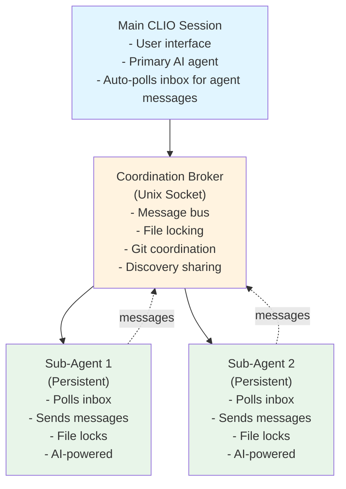

# Multi-Agent Coordination System

## Overview

**CLIO supports parallel multi-agent collaboration** where multiple AI agents work on the same codebase simultaneously without conflicts.

This system enables:
- Spawning multiple AI agents to work in parallel
- File locking to prevent concurrent edits
- Git locking to serialize commits
- Knowledge sharing between agents
- Message-based communication

---

## Architecture



---

## Key Components

| Component | File | Purpose |
|-----------|------|---------|
| **Broker** | `lib/CLIO/Coordination/Broker.pm` | Central coordination server |
| **Client** | `lib/CLIO/Coordination/Client.pm` | Broker connection API |
| **SubAgent** | `lib/CLIO/Coordination/SubAgent.pm` | Process spawning and management |
| **AgentLoop** | `lib/CLIO/Core/AgentLoop.pm` | Persistent agent event loop |
| **Commands** | `lib/CLIO/UI/Commands/SubAgent.pm` | User commands for multi-agent work |

---

## Operating Modes

### Oneshot Mode (Default)

- Agent spawns, executes single task, exits
- Uses `exec` to replace process with full CLIO
- Good for: Independent parallel tasks

### Persistent Mode

- Agent spawns, stays alive, polls for messages
- Handles multiple tasks sequentially
- Bidirectional communication (ask questions, receive guidance)
- Good for: Complex multi-step work requiring coordination

---

## Usage

### Spawning Agents

```bash
# Oneshot mode (default)
/subagent spawn "fix bug in Module::A"

# Persistent mode
/subagent spawn "refactor auth module" --persistent

# Specify model
/subagent spawn "add tests" --model gpt-4.1 --persistent
```

### Communication

```bash
# View messages from agents
/subagent inbox

# Reply to agent question
/subagent reply agent-1 "yes, proceed with that approach"

# Send guidance to specific agent
/subagent send agent-2 "try alternative implementation"

# Broadcast to all agents
/subagent broadcast "code freeze - finish current work"
```

### Monitoring

```bash
# List all agents
/subagent list

# Show detailed status
/subagent status agent-1

# View file/git locks
/subagent locks

# See shared discoveries
/subagent discoveries
```

---

## Message Types

### TO Agents

| Type | Description |
|------|-------------|
| `task` | New work assignment |
| `clarification` | Answer to agent's question |
| `guidance` | Mid-task redirection |
| `stop` | Graceful shutdown |

### FROM Agents

| Type | Display | Description |
|------|---------|-------------|
| `question` | Yellow | Agent needs help |
| `blocked` | Red | Agent waiting for input |
| `complete` | Green | Task finished |
| `status` | Cyan | Progress update |
| `discovery` | Magenta | Shared finding |

---

## File Coordination

### File Locks

- Agents must request lock before writing files
- Broker grants locks (prevents concurrent edits)
- Agents release locks after operations
- Automatic release on disconnect

**Example:**

```perl
# In agent code
$client->request_file_lock(["lib/Module.pm"]);
# ... modify file ...
$client->release_file_lock(["lib/Module.pm"]);
```

### Git Locks

- Serialize commits across all agents
- Only one agent can commit at a time
- Prevents merge conflicts

---

## Client API

### Connection

```perl
use CLIO::Coordination::Client;

my $client = CLIO::Coordination::Client->new(
    session_id => $session_id,
    agent_id => 'agent-1',
    task => 'My task',
    debug => 1,
);
```

### Messaging

```perl
# Send message
$client->send_message(
    to => 'user',              # or agent_id or 'all'
    message_type => 'question',
    content => 'Should I proceed?',
);

# Poll inbox
my $messages = $client->poll_my_inbox();

# Convenience methods
$client->send_status(
    progress => '60%',
    current_task => 'implementing auth',
);

$client->send_question(
    to => 'user',
    question => 'Use approach A or B?',
);

$client->send_complete("Task finished successfully");
$client->send_blocked("Waiting for API credentials");
```

### Coordination

```perl
# File locking
$client->request_file_lock(['file.txt']);
$client->release_file_lock(['file.txt']);

# Git locking
$client->request_git_lock();
$client->release_git_lock();

# Discovery sharing
$client->send_discovery("Found bug in Module::X", "bug-report");

# Warnings
$client->send_warning("API rate limit approaching", "medium");
```

---

## AgentLoop API

For persistent agents that need to handle multiple tasks:

```perl
use CLIO::Core::AgentLoop;

# Define task handler
my $task_handler = sub {
    my ($task, $loop) = @_;
    
    # Process task...
    
    # Return status:
    return { completed => 1, message => "Done" };
    # or: { blocked => 1, reason => "Need help" };
    # or: { status => "working", progress => "50%" };
};

# Create and run loop
my $loop = CLIO::Core::AgentLoop->new(
    client => $client,
    initial_task => $task,
    on_task => $task_handler,
    poll_interval => 1,      # Check inbox every 1 sec
    heartbeat_interval => 30, # Send heartbeat every 30 sec
);

$loop->run();  # Blocks until stop message received
```

### Task Handler Return Values

| Return | Behavior |
|--------|----------|
| `{completed => 1, message => "..."}` | Task done |
| `{blocked => 1, reason => "..."}` | Need help (auto-sends question) |
| `{status => "...", progress => N}` | Progress update |
| `undef` or `{}` | Still working |

---

## Tool Restrictions for Sub-Agents

### Blocked Tools

Sub-agents have certain tools blocked to prevent coordination issues:

| Tool | Reason |
|------|--------|
| `remote_execution` | Cannot spawn work on remote systems (prevents complexity) |
| `/subagent spawn` | Cannot spawn additional sub-agents (prevents fork bombs) |

### Coordination-Required Tools

These tools work but coordinate through the broker:

| Tool | Coordination |
|------|--------------|
| `file_operations` (write) | Requests/releases file locks automatically |
| `version_control commit` | Requests/releases git lock automatically |
| `user_collaboration` | Routes questions through broker to user inbox |

---

## Error Handling

### Broker Failure

- Tools continue working without locks (logged as warning)
- AgentLoop reconnects automatically after broker errors
- Chat.pm polling handles errors gracefully

### Agent Crash

- Broker auto-releases all locks when agent disconnects
- 120-second timeout releases locks from inactive agents
- `/subagent list` shows agents that have exited

---

## Best Practices

### When to Use Multi-Agent

✓ Large projects with independent modules
✓ Parallel test suite execution
✓ Refactoring multiple files simultaneously
✓ Research + implementation (one agent researches, another codes)

### When NOT to Use

✗ Single file edits (overhead not worth it)
✗ Sequential dependent tasks (use single agent)
✗ Simple one-liners

### Coordination Tips

1. Use file locks for all write operations
2. Serialize git commits (use git lock)
3. Share discoveries so agents learn from each other
4. Use persistent mode for complex multi-step work
5. Monitor `/subagent inbox` for questions
6. Broadcast important updates to all agents

---

## Testing

### Integration Tests

```bash
# Message bus
perl -I./lib tests/integration/test_message_bus.pl

# Agent loop
perl -I./lib tests/integration/test_agent_loop.pl

# Multi-agent collaboration (comprehensive)
perl -I./lib tests/integration/test_collaborative_team.pl
```

### Manual Testing

```bash
# Start CLIO
./clio --new

# Spawn persistent agent
/subagent spawn "create scratch/test.txt with content 'hello'" --persistent

# Check inbox (should see completion message)
/subagent inbox

# Send new task to same agent
/subagent send agent-1 "now create scratch/test2.txt"

# View discoveries
/subagent discoveries
```

### Run Demo

```bash
perl tests/integration/demo_multi_agent_system.pl
```

---

## Implementation Details

### Unix Socket Location

- **Linux:** `/dev/shm/clio/broker-SESSION_ID.sock`
- **macOS:** `/tmp/clio/broker-SESSION_ID.sock`

### Message Format

All messages are newline-delimited JSON:

```json
{"type": "register", "id": "agent-1", "task": "Fix bug"}
{"type": "request_file_lock", "files": ["lib/Module.pm"], "mode": "write"}
{"type": "lock_granted", "files": ["lib/Module.pm"], "lock_id": 1}
{"type": "discovery", "content": "Pattern found", "category": "pattern"}
```

### Dependencies

**100% Perl native** - no external CPAN modules:
- `IO::Socket::UNIX` - Unix domain sockets
- `IO::Select` - Non-blocking I/O
- `JSON::PP` - JSON encoding
- `Time::HiRes` - High-resolution timestamps
- `POSIX` - Process control

### Performance

- **Socket I/O:** <1ms latency (shared memory)
- **Lock requests:** <5ms (no blocking)
- **Broker overhead:** Minimal (<1% CPU)
- **Scalability:** Tested with 10 concurrent agents

### Security

- Unix sockets (local-only, no network exposure)
- File permissions (0777 - writable by same user)
- Process isolation (fork-based agents)
- No sensitive data in messages

---

## Troubleshooting

### Broker not starting

```bash
# Check if socket exists
ls -la /dev/shm/clio/  # or /tmp/clio on macOS

# Check broker log
tail -f /tmp/clio-broker-test.log
```

### Agent can't connect

```bash
# Verify broker is running
ps aux | grep broker

# Check socket permissions
ls -la /dev/shm/clio/broker-*.sock
```

### Lock not released

- Automatic on disconnect (agent crash)
- Timeout after 120 seconds (configurable)

---

## See Also

- [AGENTS.md](../AGENTS.md) - Development reference
- [docs/ARCHITECTURE.md](ARCHITECTURE.md) - System architecture
- [docs/USER_GUIDE.md](USER_GUIDE.md) - User documentation

---

*Last updated: 2026-02-08*
