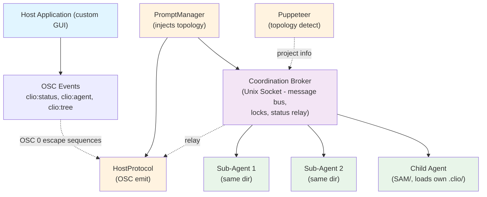
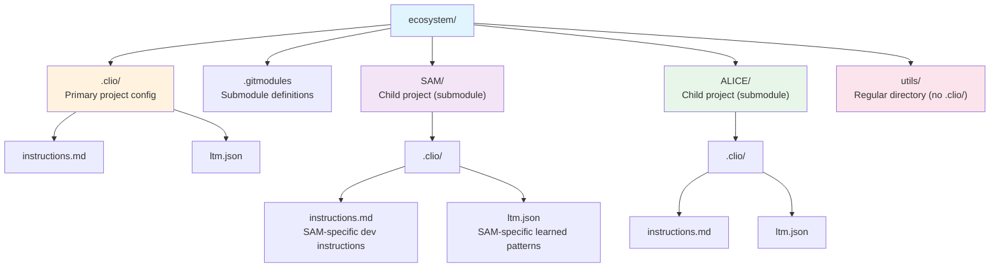
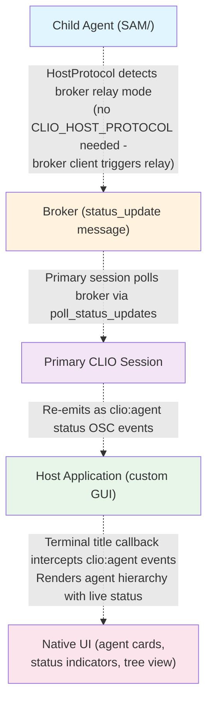
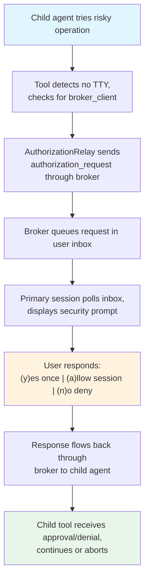
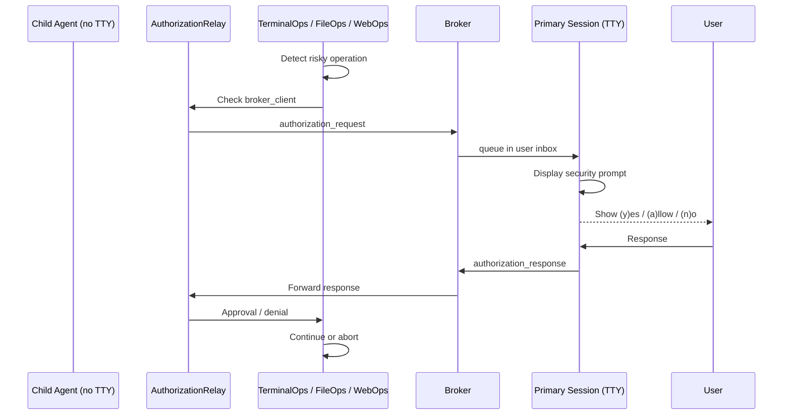

# Multi-Agent Coordination System

## Overview

CLIO supports parallel multi-agent collaboration where multiple AI agents work on the same codebase simultaneously without conflicts. The system spans three levels of coordination:

1. **Local sub-agents** - Parallel processes working on different tasks in the same project
2. **Puppeteer orchestration** - Project-scoped agents that work inside child projects with their own LTM and instructions
3. **Remote agents** - Agents running on remote machines via SSH

All three levels share the same coordination infrastructure: broker messaging, file/git locking, status relay, and host protocol events.

---

## Architecture


```mermaid
graph TD
    HostApp["Host Application (custom GUI)"]
    OSCEvents["OSC Events<br/>clio:status, clio:agent, clio:tree"]
    PromptMgr["PromptManager<br/>(injects topology)"]
    HostProto["HostProtocol<br/>(OSC emit)"]
    Pupp["Puppeteer<br/>(topology detect)"]
    Broker["Coordination Broker<br/>(Unix Socket - message bus,<br/>locks, status relay)"]
    SA1["Sub-Agent 1<br/>(same dir)"]
    SA2["Sub-Agent 2<br/>(same dir)"]
    CA["Child Agent<br/>(SAM/, loads own .clio/)"]

    HostApp --> OSCEvents
    OSCEvents -. "OSC 0 escape sequences" .-> HostProto
    PromptMgr --> HostProto
    PromptMgr --> Broker
    Pupp -. "project info" .-> Broker
    Broker -. "relay" .-> HostProto
    Broker --> SA1
    Broker --> SA2
    Broker --> CA

    style HostApp fill:#e1f5ff
    style PromptMgr fill:#fff3e0
    style HostProto fill:#fff3e0
    style Pupp fill:#fff3e0
    style Broker fill:#f3e5f5
    style SA1 fill:#e8f5e9
    style SA2 fill:#e8f5e9
    style CA fill:#e8f5e9
```

---

## Key Components

| Component | File | Purpose |
|-----------|------|---------|
| **Broker** | `lib/CLIO/Coordination/Broker.pm` | Central coordination server (messaging, locks, status relay) |
| **Client** | `lib/CLIO/Coordination/Client.pm` | Broker connection API for agents |
| **SubAgent** | `lib/CLIO/Coordination/SubAgent.pm` | Process spawning and management |
| **AgentLoop** | `lib/CLIO/Core/AgentLoop.pm` | Persistent agent event loop |
| **Puppeteer** | `lib/CLIO/Protocols/Puppeteer.pm` | Topology detection and project-scoped delegation |
| **HostProtocol** | `lib/CLIO/UI/HostProtocol.pm` | OSC event emission and broker relay |
| **PromptManager** | `lib/CLIO/Core/PromptManager.pm` | System prompt assembly with topology injection |
| **Commands** | `lib/CLIO/UI/Commands/SubAgent.pm` | User commands (`/subagent`) |

---

## Puppeteer: Multi-Project Orchestration

Puppeteer lets a primary CLIO session manage work across multiple child projects. Each child project can have its own `.clio/` directory with project-specific LTM, instructions, and memory. When work is delegated, the child agent starts inside that project's directory and loads its full context automatically.

### How Topology Detection Works

Puppeteer scans for child projects in two ways:

1. **Git submodules** - Parses `.gitmodules` for submodule entries and checks each for a `.clio/` directory
2. **Directory scanning** - Looks at top-level directories for any containing `.clio/`

The scan runs at session start (via PromptManager) and populates the agent's system prompt with a list of available projects and their capabilities.

### Example Topology


```mermaid
graph TD
    Root["ecosystem/"]
    Root --> Clio[".clio/<br/>Primary project config"]
    Clio --> ClioInst["instructions.md"]
    Clio --> ClioLtm["ltm.json"]
    Root --> Gitmodules[".gitmodules<br/>Submodule definitions"]
    Root --> SAM["SAM/<br/>Child project (submodule)"]
    SAM --> SClio[".clio/"]
    SClio --> SInst["instructions.md<br/>SAM-specific dev instructions"]
    SClio --> SLtm["ltm.json<br/>SAM-specific learned patterns"]
    Root --> ALICE["ALICE/<br/>Child project (submodule)"]
    ALICE --> AClio[".clio/"]
    AClio --> AInst["instructions.md"]
    AClio --> ALtm["ltm.json"]
    Root --> Utils["utils/<br/>Regular directory (no .clio/)"]

    style Root fill:#e1f5ff
    style Clio fill:#fff3e0
    style SAM fill:#f3e5f5
    style ALICE fill:#e8f5e9
    style Utils fill:#fce4ec
```

The primary agent's system prompt automatically includes:

```text
```
## Puppeteer Topology

This project manages 2 child project(s):

- **ALICE** (ALICE) [LTM, instructions, submodule]
- **SAM** (SAM) [LTM, instructions, submodule]

To delegate work to a project, spawn a sub-agent with working_dir:
agent_operations(operation: "spawn", task: "...", working_dir: "./SAM")
The child agent will load that project's .clio/ context (LTM, instructions, memory).
```text

```
### Spawning Project-Scoped Agents

There are three ways to delegate work to a child project:

**Via `/subagent` command with `--project`:**
```bash
/subagent spawn "run tests and fix failures" --project SAM
```

The `--project` flag resolves the project name through Puppeteer's topology, finds the absolute path, and sets the working directory.

**Via `/subagent` command with `--dir`:**
```bash
/subagent spawn "check dependencies" --dir ../external-project
```

The `--dir` flag works with any directory, not just detected projects. This is useful for ad-hoc delegation to projects outside the topology.

**Via AI tool call:**
```json
{
  "operation": "spawn",
  "task": "fix failing integration tests",
  "working_dir": "./SAM"
}
```

The AI can use this after reading the topology from its system prompt.

### What the Child Agent Gets

When a child agent starts in a project directory:

1. **Working directory** is set to the project root
2. **`.clio/instructions.md`** is loaded as project-specific instructions
3. **`.clio/ltm.json`** is loaded as project-specific long-term memory
4. **`.clio/memory/`** is available for session memory
5. **`CLIO_PUPPETEER`** environment variable is set, telling the agent it was delegated
6. The agent's system prompt includes delegation context about who spawned it and why

### Listing Available Projects

```text
/subagent projects
```

Shows all detected child projects with their capabilities:

```text
  Puppeteer Topology

  Project        Path       Source      LTM  Instructions
  ALICE          ./ALICE    submodule    ✓       ✓
  SAM        ./SAM  submodule    ✓       ✓
```

---

## OSC Host Protocol and Agent Events

### Status Relay Pipeline

When sub-agents (especially project-scoped ones) run inside a session, their status changes flow back to the primary session and out to any host application through a relay pipeline:


```mermaid
graph TD
    CA["Child Agent (SAM/)"]
    Broker["Broker (status_update message)"]
    Primary["Primary CLIO Session"]
    HostApp["Host Application (custom GUI)"]
    NativeUI["Native UI (agent cards,<br/>status indicators, tree view)"]

    CA -. "HostProtocol detects broker relay mode<br/>(no CLIO_HOST_PROTOCOL needed -<br/>broker client triggers relay)" .-> Broker
    Broker -. "Primary session polls broker via poll_status_updates" .-> Primary
    Primary -. "Re-emits as clio:agent status OSC events" .-> HostApp
    HostApp -. "Terminal title callback intercepts clio:agent events<br/>Renders agent hierarchy with live status" .-> NativeUI

    style CA fill:#e1f5ff
    style Broker fill:#fff3e0
    style Primary fill:#f3e5f5
    style HostApp fill:#e8f5e9
    style NativeUI fill:#fce4ec
```

### Agent Events

Three new OSC event types enable host applications to render full agent hierarchies:

| Event | Actions | Payload |
|-------|---------|---------|
| `clio:agent` | `spawn`, `status`, `message`, `exit` | agent_id, task, state, tool, message |
| `clio:remote` | `start`, `progress`, `complete`, `error` | host, task, progress, result |
| `clio:tree` | (snapshot) | Full agent tree with hierarchy, status, and project info |

**Example event payloads:**

```json
// Agent spawned
clio:agent:{"action":"spawn","id":"agent-1","task":"fix tests","project":"SAM"}

// Agent status change (relayed from broker)
clio:agent:{"action":"status","id":"agent-1","state":"tools","tool":"terminal_operations"}

// Agent completed
clio:agent:{"action":"exit","id":"agent-1","exit_code":0}

// Full tree snapshot
clio:tree:{"primary":{"state":"idle"},"agents":[{"id":"agent-1","task":"fix tests","project":"SAM","state":"tools"}]}
```

### Broker Relay Details

The relay works through two mechanisms:

**Child side (automatic):** When SubAgent spawns a process, the child's HostProtocol gets a broker Client via `set_broker_relay()`. Every `emit_status()` and `emit_tool_start()` call additionally sends a `status_update` message to the broker. This requires no configuration - it happens automatically for any coordinated agent.

**Primary side (polling):** The primary session's WorkflowOrchestrator periodically calls `poll_status_updates()` on the broker client. Any accumulated status updates are re-emitted as `clio:agent status` OSC events for the host application.

---

## Operating Modes

### Oneshot Mode (Default)

- Agent spawns, executes single task, exits
- Uses `exec` to replace process with full CLIO
- Default model: `gpt-4.1` (via GitHub Copilot) or `minimax-m2.7` (via MiniMax)
- Iteration limit: 75 (non-interactive default)
- Good for: Independent parallel tasks

### Persistent Mode

- Agent spawns, stays alive, polls for messages
- Handles multiple tasks sequentially
- Bidirectional communication (ask questions, receive guidance)
- Good for: Complex multi-step work requiring coordination

---

## Usage

### Spawning Agents

```bash
# Oneshot mode (default)
/subagent spawn "fix bug in Module::A"

# Persistent mode
/subagent spawn "refactor auth module" --persistent

# Specify model
/subagent spawn "add tests" --model minimax/minimax-m2.7

# Project-scoped (Puppeteer)
/subagent spawn "run tests" --project SAM

# Arbitrary directory
/subagent spawn "check deps" --dir ../other-project
```

### Communication

```bash
# View messages from agents
/subagent inbox

# Reply to agent question
/subagent reply agent-1 "yes, proceed with that approach"

# Send guidance to specific agent
/subagent send agent-2 "try alternative implementation"

# Broadcast to all agents
/subagent broadcast "code freeze - finish current work"
```

### Monitoring

```bash
# List all agents
/subagent list

# Show detailed status
/subagent status agent-1

# View file/git locks
/subagent locks

# See shared discoveries
/subagent discoveries

# List child projects
/subagent projects
```

---

## Message Types

### TO Agents

| Type | Description |
|------|-------------|
| `task` | New work assignment |
| `clarification` | Answer to agent's question |
| `guidance` | Mid-task redirection |
| `stop` | Graceful shutdown |

### FROM Agents

| Type | Display | Description |
|------|---------|-------------|
| `question` | Yellow | Agent needs help |
| `blocked` | Red | Agent waiting for input |
| `complete` | Green | Task finished |
| `status` | Cyan | Progress update |
| `discovery` | Magenta | Shared finding |

---

## File Coordination

### File Locks

- Agents must request lock before writing files
- Broker grants locks (prevents concurrent edits)
- Agents release locks after operations
- Automatic release on disconnect

**Example:**

```perl
$client->request_file_lock(["lib/Module.pm"]);
# ... modify file ...
$client->release_file_lock(["lib/Module.pm"]);
```

### Git Locks

- Serialize commits across all agents
- Only one agent can commit at a time
- Prevents merge conflicts

---

## Client API

### Connection

```perl
use CLIO::Coordination::Client;

my $client = CLIO::Coordination::Client->new(
    session_id => $session_id,
    agent_id => 'agent-1',
    task => 'My task',
    debug => 1,
);
```

### Messaging

```perl
# Send message
$client->send_message(
    to => 'user',
    message_type => 'question',
    content => 'Should I proceed?',
);

# Poll inbox
my $messages = $client->poll_my_inbox();

# Convenience methods
$client->send_status(
    progress => '60%',
    current_task => 'implementing auth',
);

$client->send_question(
    to => 'user',
    question => 'Use approach A or B?',
);

$client->send_complete("Task finished successfully");
$client->send_blocked("Waiting for API credentials");
```

### Status Relay

```perl
# Send status update (child agent -> broker -> primary)
$client->send_status_update(
    state => 'tools',
    tool  => 'file_operations',
    message => 'reading config files',
);

# Poll status updates (primary -> from broker)
my $response = $client->poll_status_updates();
for my $update (@{$response->{updates}}) {
    printf "Agent %s: %s (%s)\n",
        $update->{agent_id}, $update->{state}, $update->{tool} // '';
}
```

### Coordination

```perl
# File locking
$client->request_file_lock(['file.txt']);
$client->release_file_lock(['file.txt']);

# Git locking
$client->request_git_lock();
$client->release_git_lock();

# Discovery sharing
$client->send_discovery("Found bug in Module::X", "bug-report");

# Warnings
$client->send_warning("API rate limit approaching", "medium");
```

---

## AgentLoop API

For persistent agents that need to handle multiple tasks:

```perl
use CLIO::Core::AgentLoop;

my $task_handler = sub {
    my ($task, $loop) = @_;
    # Process task...
    return { completed => 1, message => "Done" };
};

my $loop = CLIO::Core::AgentLoop->new(
    client => $client,
    initial_task => $task,
    on_task => $task_handler,
    poll_interval => 1,
    heartbeat_interval => 30,
);

$loop->run();  # Blocks until stop message received
```

### Task Handler Return Values

| Return | Behavior |
|--------|----------|
| `{completed => 1, message => "..."}` | Task done |
| `{blocked => 1, reason => "..."}` | Need help (auto-sends question) |
| `{status => "...", progress => N}` | Progress update |
| `undef` or `{}` | Still working |

---

## Tool Restrictions for Sub-Agents

### Blocked Tools

Sub-agents have certain tools blocked to prevent coordination issues:

| Tool | Reason |
|------|--------|
| `remote_execution` | Cannot spawn work on remote systems (prevents complexity) |
| `/subagent spawn` | Cannot spawn additional sub-agents (prevents fork bombs) |

### Coordination-Required Tools

These tools work but coordinate through the broker:

| Tool | Coordination |
|------|--------------|
| `file_operations` (write) | Requests/releases file locks automatically |
| `version_control commit` | Requests/releases git lock automatically |
| `interact` | Routes questions through broker to user inbox |

---

## Error Handling

### Broker Failure

- Tools continue working without locks (logged as warning)
- AgentLoop reconnects automatically after broker errors
- Chat.pm polling handles errors gracefully

### Broker Lifecycle

The broker starts automatically when you spawn a sub-agent. It runs as a separate background process connected via Unix socket.

**Idle timeout:** After all agents disconnect, the broker waits 5 minutes (300 seconds) for a new connection. If no clients reconnect, it exits cleanly.

### Agent Crash

- Broker auto-releases all locks when agent disconnects
- 120-second timeout releases locks from inactive agents
- `/subagent list` shows agents that have exited

### Status Relay Limits

The broker caps accumulated status updates at 100 entries. Older entries are discarded. This prevents memory growth in long-running sessions with many agents. The primary session drains updates on each poll.

---

## Best Practices

### When to Use Multi-Agent

- Large projects with independent modules
- Parallel test suite execution
- Refactoring multiple files simultaneously
- Research + implementation (one agent researches, another codes)

### When to Use Puppeteer

- Ecosystem projects with multiple repositories
- Monorepos with independent services
- Projects where each component has its own development conventions
- When you want child agents to have project-specific context (LTM, instructions)

### When NOT to Use

- Single file edits (overhead not worth it)
- Sequential dependent tasks (use single agent)
- Simple one-liners

### Coordination Tips

1. Use file locks for all write operations
2. Serialize git commits (use git lock)
3. Share discoveries so agents learn from each other
4. Use oneshot mode (default) for focused single tasks; persistent mode for long-running agents
5. Monitor `/subagent inbox` for questions - agents send messages when they need decisions
6. Broadcast important updates to all agents with `/subagent broadcast <message>`
7. Use `--project` for child projects with `.clio/` context, `--dir` for arbitrary directories

---

## Testing

### Unit Tests

```bash
# Broker tests (27 subtests including status relay)
perl -I./lib tests/unit/test_broker.pl

# Host protocol tests (37 tests including broker relay)
perl -I./lib tests/unit/test_host_protocol.pl

# Puppeteer topology tests (11 subtests)
perl -I./lib tests/unit/test_puppeteer.pl

# SubAgent command parsing tests (11 subtests)
perl -I./lib tests/unit/test_subagent_commands.pl

# Client API tests
perl -I./lib tests/unit/test_client.pl
```

### Integration Tests

```bash
# Message bus
perl -I./lib tests/integration/test_message_bus.pl

# Agent loop
perl -I./lib tests/integration/test_agent_loop.pl

# Multi-agent collaboration (comprehensive)
perl -I./lib tests/integration/test_collaborative_team.pl
```

### Manual Testing

```bash
# Start CLIO in a project with child directories
./clio --new

# Check detected topology
/subagent projects

# Spawn project-scoped agent
/subagent spawn "run tests" --project ChildProject

# Check inbox for completion
/subagent inbox
```

---

## Implementation Details

### Unix Socket Location

- **Linux:** `/dev/shm/clio/broker-SESSION_ID.sock`
- **macOS:** `/tmp/clio/broker-SESSION_ID.sock`

### Message Format

All messages are newline-delimited JSON:

```json
{"type": "register", "id": "agent-1", "task": "Fix bug"}
{"type": "request_file_lock", "files": ["lib/Module.pm"], "mode": "write"}
{"type": "lock_granted", "files": ["lib/Module.pm"], "lock_id": 1}
{"type": "status_update", "agent_id": "agent-1", "state": "tools", "tool": "file_operations"}
{"type": "poll_status_updates"}
{"type": "status_updates", "updates": [...], "count": 2}
```

### Environment Variables

| Variable | Purpose |
|----------|---------|
| `CLIO_HOST_PROTOCOL` | Enables OSC event emission (set by host app) |
| `CLIO_PUPPETEER` | Set on child agents to indicate delegated context |
| `CLIO_PARENT_SESSION` | Session ID of the spawning parent |

### Dependencies

**100% Perl native** - no external CPAN modules:
- `IO::Socket::UNIX` - Unix domain sockets
- `IO::Select` - Non-blocking I/O
- `JSON::PP` - JSON encoding
- `Time::HiRes` - High-resolution timestamps
- `POSIX` - Process control

### Performance

- **Socket I/O:** <1ms latency (shared memory)
- **Lock requests:** <5ms (no blocking)
- **Broker overhead:** Minimal (<1% CPU)
- **Status relay:** Buffered, polled by primary (no real-time push needed)
- **Scalability:** Tested with 10 concurrent agents

### Security

- Unix sockets (local-only, no network exposure)
- File permissions (0777 - writable by same user)
- Process isolation (fork-based agents)
- No sensitive data in messages
- **Authorization relay** for security prompts (see below)

---

## Authorization Relay

Sub-agents run headless (no TTY) so they cannot display interactive security prompts. When a child agent encounters a security-gated operation - risky shell commands, script creation with flagged content, or URL fetches requiring confirmation - the **Authorization Relay** routes the request to the primary session where the user can respond.

### Flow


```mermaid
graph TD
    Start["Child agent tries risky operation"]
    TTYCheck["Tool detects no TTY,<br/>checks for broker_client"]
    SendReq["AuthorizationRelay sends<br/>authorization_request through broker"]
    Queue["Broker queues request in user inbox"]
    Poll["Primary session polls inbox,<br/>displays security prompt"]
    Respond["User responds:<br/>(y)es once | (a)llow session | (n)o deny"]
    Reply["Response flows back through<br/>broker to child agent"]
    Result["Child tool receives approval/denial,<br/>continues or aborts"]

    Start --> TTYCheck --> SendReq --> Queue --> Poll --> Respond --> Reply --> Result

    style Start fill:#e1f5ff
    style Respond fill:#fff3e0
    style Result fill:#e8f5e9
```

### Architecture


```mermaid
sequenceDiagram
    participant CA as Child Agent (no TTY)
    participant AR as AuthorizationRelay
    participant Tools as TerminalOps / FileOps / WebOps
    participant Broker
    participant Primary as Primary Session (TTY)

    Tools->>Tools: Detect risky operation
    Tools->>AR: Check broker_client
    AR->>Broker: authorization_request
    Broker->>Primary: queue in user inbox
    Primary->>Primary: Display security prompt
    Primary-->>User: Show (y)es / (a)llow / (n)o
    User->>Primary: Response
    Primary->>Broker: authorization_response
    Broker->>AR: Forward response
    AR->>Tools: Approval / denial
    Tools->>Tools: Continue or abort
```

### Components

| Component | File | Role |
|-----------|------|------|
| `AuthorizationRelay` | `lib/CLIO/Security/AuthorizationRelay.pm` | Client-side relay (child agent) |
| `Broker` | `lib/CLIO/Coordination/Broker.pm` | Routes requests/responses |
| `Client` | `lib/CLIO/Coordination/Client.pm` | Transport methods |
| `Chat` | `lib/CLIO/UI/Chat.pm` | Displays prompts, sends responses |
| `WorkflowOrchestrator` | `lib/CLIO/Core/WorkflowOrchestrator.pm` | Polls for auth requests between tools |

### Covered Security Prompts

| Tool | Prompt Function | Category |
|------|-----------------|----------|
| TerminalOperations | `_prompt_command_confirmation` | `command_execution` |
| FileOperations | `_prompt_script_confirmation` | `script_creation` |
| WebOperations | `_prompt_url_confirmation` | `web_fetch` |

### Behavior

- **Timeout:** 60 seconds (configurable). If no response, the operation is denied.
- **Session grants:** When the user selects "(a)llow session", the grant is stored in the child agent's process (same as interactive mode).
- **Fallback:** If no broker is connected, operations are denied (same as pre-relay behavior).
- **Cleanup:** Pending requests are cleaned up when a child agent disconnects.
- **Polling:** The primary session checks for auth requests both in the input loop and between tool executions.

---

## See Also

- [FEATURES.md](FEATURES.md) - Feature overview (sections 11, 16, 21)
- [ARCHITECTURE.md](ARCHITECTURE.md) - System architecture
- [REMOTE_EXECUTION.md](REMOTE_EXECUTION.md) - Remote agent execution
- [USER_GUIDE.md](USER_GUIDE.md) - User documentation
- [AGENTS.md](../AGENTS.md) - Development reference

---

*Last updated: 2026-04-14*
