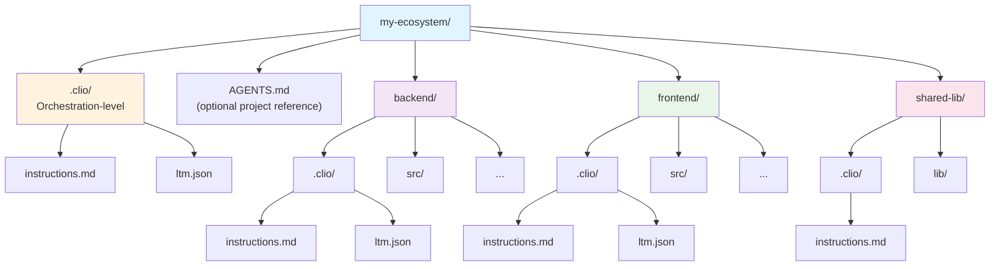

# Puppeteer Mode

**Orchestrate work across multiple projects from a single CLIO session**

---

## What Is Puppeteer Mode?

Puppeteer mode activates automatically when CLIO detects that your working directory contains child projects - subdirectories with their own `.clio/` configuration. Instead of working in one project at a time, you can delegate tasks to any child project while maintaining oversight from a single terminal.

Think of it as a team lead sitting at a desk, dispatching work to specialists who each know their own codebase. The lead (your CLIO session) coordinates. The specialists (sub-agents) do the work in context.

---

## When to Use It

- **Multi-project ecosystems** - A parent directory containing several related repositories
- **Monorepos with distinct components** - Different services, libraries, or apps in subdirectories
- **Cross-project coordination** - Changes that touch multiple codebases need a central coordinator
- **Parallel work** - Fix bugs in three projects simultaneously instead of sequentially

---

## Setting It Up

### Directory Structure

Puppeteer mode needs a parent directory with child projects. Each child project that should be delegatable needs a `.clio/` directory:



### Creating a Puppeteer Project

The fastest way to set up puppeteer mode is with CLIO's built-in `/design` and `/init` commands.

**Step 1: Design the project**

Start CLIO in the parent directory (the one containing your child projects) and use `/design` to create a PRD:

```bash
cd ~/my-ecosystem
clio

[claude-sonnet-4] my-ecosystem: /design
```

CLIO walks you through an interactive design session. Describe your ecosystem - what projects it contains, how they relate, what the orchestration layer should do. This is a good time to mention your preferred AI models and cost strategy - for example, which model to use for cheap parallel work versus complex implementation. CLIO generates a `.clio/PRD.md` capturing the architecture, child project relationships, delegation patterns, and conventions.

**Step 2: Initialize from the PRD**

Once the PRD looks right, run `/init`:

```text
[claude-sonnet-4] my-ecosystem: /init
```

CLIO reads the PRD and generates:
- `.clio/instructions.md` - orchestration-level instructions for the AI
- `AGENTS.md` - technical reference doc listing all child projects, their tech stacks, integration points, and delegation patterns (including model selection guidance if you specified preferences during design)

This is the same workflow used to create the Synthetic Autonomic Mind puppeteer project that orchestrates 12 repositories. The initial `/design` session captured the full ecosystem architecture, and `/init` generated the configuration that makes delegation work.

**Step 3: Start working**

From here, you're in puppeteer mode. CLIO detects the child projects and you can start delegating:

```text
[claude-sonnet-4] my-ecosystem: Fix the rate limiting bug in the backend API
```

CLIO spawns a sub-agent in the backend project with full context.

### Manual Setup

If you prefer to set things up by hand (or already have `.clio/` in your child projects):

1. Create a parent directory (or use an existing one)
2. Add `.clio/instructions.md` to the parent - this tells CLIO how to orchestrate
3. Add `.clio/instructions.md` to each child project - these tell sub-agents how to work in that project
4. Start CLIO from the parent directory

That's it. CLIO scans for child projects at startup and injects the topology into the AI's context.

### What Goes in Each instructions.md

**Parent (orchestration level):**
```markdown
# My Ecosystem

## Child Projects
- **backend** - REST API server (Python/FastAPI)
- **frontend** - Web UI (TypeScript/React)
- **shared-lib** - Common utilities

## Delegation Rules
- Code changes go to sub-agents in the appropriate project
- Cross-project changes: coordinate from here, delegate implementation
- No source code lives at this level
```

**Child (project level):**
```markdown
# Backend API

## Development
- Python 3.11+, FastAPI
- Tests: `pytest tests/`
- Linting: `ruff check src/`

## Conventions
- All endpoints go in src/routes/
- Database models in src/models/
- Always run tests before committing
```

### Git Submodules (Optional)

If your child projects are git submodules, CLIO detects them automatically via `.gitmodules`. This isn't required - any subdirectory with `.clio/` is detected.

---

## Using Puppeteer Mode

### Automatic Topology Detection

When you start CLIO in a puppeteer directory, you'll see the detected topology in the system prompt context. The AI knows what projects are available and how to delegate to them.

### Delegating Tasks

**Talk naturally:**
```text
[claude-sonnet-4] my-ecosystem: Fix the authentication bug in the backend
  - users are getting 401 errors on valid tokens.
```

CLIO will spawn a sub-agent in `./backend` with the task, the backend's instructions and LTM loaded automatically.

**Be specific about the project:**
```text
[claude-sonnet-4] my-ecosystem: In the frontend, update the login form to
  show better error messages when the API returns 401.
```

**Coordinate across projects:**
```text
[claude-sonnet-4] my-ecosystem: The shared-lib date formatting is wrong -
  it's breaking both the backend API responses and the frontend display.
  Fix it in shared-lib, then verify both backend and frontend tests still pass.
```

CLIO will typically spawn agents in sequence or parallel depending on dependencies.

### Using Slash Commands

List available projects:
```text
/subagent projects
```

Spawn a sub-agent in a specific project:
```text
/subagent spawn "run the test suite and fix any failures" --project backend
```

Spawn in an arbitrary directory:
```bash
/subagent spawn "check for dependency updates" --dir ../other-project
```

Check on running agents:
```bash
/subagent list
/subagent inbox
```

### How Delegation Works Under the Hood

1. CLIO spawns a new process with its working directory set to the child project
2. The child agent loads that project's `.clio/instructions.md` and `.clio/ltm.json`
3. Communication happens through CLIO's coordination broker (Unix socket message bus)
4. The child agent works autonomously - reading files, running commands, making changes
5. When done (or if it has questions), it sends a message back through the broker
6. The parent session receives the message and can review, approve, or redirect

### Choosing Models for Sub-Agents

Different tasks need different capability levels. You can specify the model when spawning:

```text
/subagent spawn "audit the codebase for SQL injection" --project backend --model gpt-4.1
```

A practical cost strategy:

| Task Type | Model Choice | Why |
|-----------|-------------|-----|
| Code review, audits, investigation | Cheapest capable model | High volume, read-only work |
| Implementation, refactoring | Mid-tier model | Needs good reasoning |
| Architecture, complex coordination | Top-tier model | Rare, high-stakes decisions |

When the AI is orchestrating, it can also select models per-agent based on task complexity.

---

## Real-World Example

Here's a real workflow from a session managing 12 projects:

```text
User: We renamed user_collaboration to interact in CLIO. Check all the
      other projects for stale references and update them.

CLIO's approach:
1. Surveyed all 12 child projects for references (seconds, not minutes)
2. Identified 6 projects with stale references
3. Spawned parallel sub-agents for CLIO docs and clio-skills
4. Fixed the remaining projects directly (single-line changes)
5. Committed each project independently
6. Pushed all 6 projects to origin

Total time: ~3 minutes for work across 6 repositories
```

Another example - parallel QA:

```text
User: Run a security audit across all backend services.

CLIO's approach:
1. Spawned 4 sub-agents simultaneously, one per service
2. Each agent loaded its project's context and ran the audit
3. Results collected back at the orchestration level
4. Consolidated report presented to the user
```

---

## Tips

**Write good child instructions.** The better your `.clio/instructions.md` in each project, the more effective sub-agents are. Include: language/framework, how to run tests, coding conventions, known gotchas.

**Use LTM in child projects.** When a sub-agent discovers something important (a bug pattern, a deployment quirk), it saves it to that project's LTM. Future agents inherit that knowledge.

**Don't over-orchestrate.** If work is entirely within one project, just `cd` into it and run CLIO there. Puppeteer mode shines when you need cross-project coordination or parallel work.

**Let agents finish.** After spawning a sub-agent, wait for it to complete or ask a question. Don't jump in and do the work yourself - that defeats the purpose.

**Review before pushing.** Sub-agents commit to local branches. Review their changes at the orchestration level before pushing to remote.

---

## Comparison

| Approach | Best For |
|----------|----------|
| Single CLIO session | Working in one project |
| Puppeteer mode | Coordinating across multiple projects |
| `/subagent spawn` | Ad-hoc parallel work within one project |
| Remote execution | Running tasks on other machines |

---

## Troubleshooting

**"No child projects detected"**
- Make sure child directories have `.clio/` subdirectories
- Run CLIO from the parent directory, not from inside a child

**Sub-agent not loading project context**
- Verify `.clio/instructions.md` exists in the child project
- Check that the `working_dir` path is correct (relative to where CLIO started)

**Sub-agent can't find files**
- Sub-agents run from the child project root, not the parent
- File paths in tasks should be relative to the child project

**Messages not arriving**
- The coordination broker starts automatically when sub-agents are spawned
- Check `/subagent list` to see agent status
- Check `/subagent inbox` for pending messages

---

## Further Reading

- [Multi-Agent Coordination](MULTI_AGENT_COORDINATION.md) - Technical internals of the broker, messaging, and agent lifecycle
- [Remote Execution](REMOTE_EXECUTION.md) - Running agents on other machines
- [Custom Instructions](CUSTOM_INSTRUCTIONS.md) - Writing effective `.clio/instructions.md`
