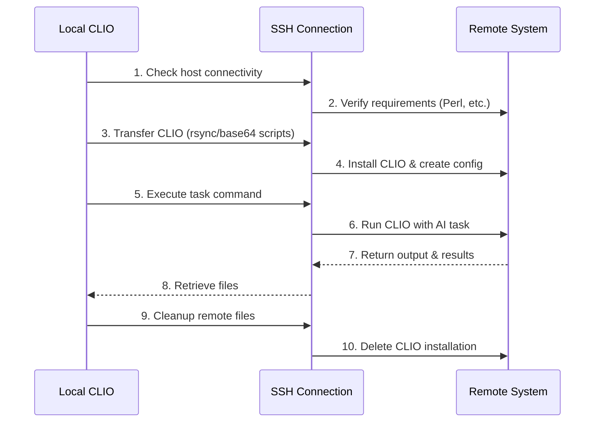

# Remote Execution Guide

**Distributed AI Agent Workflows with CLIO**

---

## Overview

CLIO's remote execution capability allows you to run AI-powered tasks on remote systems via SSH. This transforms CLIO from a local development assistant into a distributed orchestration platform.

### Key Capabilities

- **Execute AI tasks on remote systems** - Run CLIO with any task on any SSH-accessible machine
- **Auto-authentication** - GitHub Copilot tokens are securely forwarded (never written to disk)
- **Automatic setup** - CLIO downloads and configures itself on the remote system
- **Clean execution** - Temporary files are automatically cleaned up after execution
- **Result retrieval** - Capture output and optionally retrieve files from remote systems

### Use Cases

| Use Case | Description |
|----------|-------------|
| **System Analysis** | Gather diagnostics, hardware info, and logs from remote servers |
| **Distributed Builds** | Compile code on systems with specific hardware/architecture |
| **Multi-Environment Testing** | Run tests across different OS/hardware configurations |
| **Remote Debugging** | Investigate issues on production or staging systems |
| **Infrastructure Management** | Audit and analyze multiple systems from one location |
| **Hardware-Specific Tasks** | Utilize GPU, ARM, or specialized hardware on remote systems |

---

## Quick Start

### Basic Usage

The simplest way to execute a remote task:

```
Use remote_execution to check the disk space on myserver
```

CLIO will:
1. SSH into the server
2. Download and install CLIO temporarily
3. Execute the task using your configured model
4. Return the results
5. Clean up automatically

### Prerequisites

1. **SSH Access** - Password-less SSH key authentication to the remote system
2. **Remote Requirements**:
   - Perl 5.32+ installed
   - curl or wget available
   - ~50MB free disk space in /tmp
3. **GitHub Copilot** (or other API provider) - For AI model access

---

## SSH Setup (REQUIRED)

Remote execution **requires** passwordless SSH authentication. CLIO will not work with password-based SSH or prompt for passphrases during execution.

### Why SSH Keys + Agent?

- **Security**: Keys are more secure than passwords
- **Automation**: No manual password entry during execution
- **Parallel Execution**: Multiple simultaneous connections without password prompts
- **Best Practice**: Industry standard for remote automation

### Quick Setup (5 Minutes)

#### 1. Generate SSH Key (if you don't have one)

```bash
# Generate ed25519 key (recommended)
ssh-keygen -t ed25519 -C "your_email@example.com"

# Or RSA if ed25519 not supported
ssh-keygen -t rsa -b 4096 -C "your_email@example.com"

# When prompted:
# - Accept default location (~/.ssh/id_ed25519)
# - Optionally set a passphrase (recommended for security)
```

**Passphrase Recommendation:**
- **Use one** - Protects your key if laptop is lost/stolen
- ssh-agent will cache it so you only enter it once per session
- CLIO will fail gracefully if passphrase needed but not in agent

#### 2. Copy Key to Remote System

```bash
# Copy your public key to remote
ssh-copy-id user@remote-host

# For non-standard port:
ssh-copy-id -p 2222 user@remote-host

# For specific key:
ssh-copy-id -i ~/.ssh/id_ed25519.pub user@remote-host
```

This adds your public key to `~/.ssh/authorized_keys` on the remote system.

#### 3. Start ssh-agent

```bash
# Start ssh-agent (one-time per terminal session)
eval "$(ssh-agent -s)"

# Verify agent is running
ssh-add -l
```

**Make it persistent** - Add to your shell startup file (`~/.bashrc`, `~/.zshrc`, etc.):

```bash
# Auto-start ssh-agent
if [ -z "$SSH_AUTH_SOCK" ]; then
  eval "$(ssh-agent -s)" > /dev/null
fi
```

#### 4. Add Your Key to ssh-agent

```bash
# Add your private key to agent
ssh-add ~/.ssh/id_ed25519

# If you set a passphrase, enter it now
# ssh-agent will remember it for the session

# Verify key is loaded
ssh-add -l
```

You should see output like:
```
256 SHA256:xxxxx... your_email@example.com (ED25519)
```

#### 5. Test Passwordless Connection

```bash
# Test connection (should NOT prompt for password or passphrase)
ssh user@remote-host exit

# If successful (no prompts), you're ready!
```

---

### Validation

CLIO automatically validates SSH setup before executing remote tasks:

✓ Checks if ssh-agent is running  
✓ Verifies passwordless connection to remote  
✓ Provides clear guidance if setup incomplete

**Example Error:**

```
SSH agent not running. Remote execution requires SSH agent or explicit key.

Setup guide:
1. Start ssh-agent: eval "$(ssh-agent -s)"
2. Add your key: ssh-add ~/.ssh/id_rsa (or id_ed25519)
3. Test connection: ssh user@host exit

See docs/REMOTE_EXECUTION.md for detailed setup instructions.
```

---

### Alternative: Explicit SSH Key

If you don't want to use ssh-agent, specify a key directly:

```json
{
  "operation": "execute_remote",
  "host": "user@remote",
  "ssh_key": "/path/to/private/key",
  "command": "your task"
}
```

**Note:** The key file must **not** have a passphrase, as CLIO cannot prompt for it.

---

### Troubleshooting SSH Setup

#### "Permission denied (publickey)"

**Cause:** Your public key isn't on the remote system.

**Fix:**
```bash
ssh-copy-id user@remote-host
```

#### "ssh-add -l" says "Could not open a connection to your authentication agent"

**Cause:** ssh-agent isn't running.

**Fix:**
```bash
eval "$(ssh-agent -s)"
ssh-add ~/.ssh/id_ed25519
```

#### "ssh-add -l" says "The agent has no identities"

**Cause:** No keys loaded in agent.

**Fix:**
```bash
ssh-add ~/.ssh/id_ed25519
```

#### Connection prompts for passphrase every time

**Cause:** Key has passphrase but isn't in ssh-agent.

**Fix:**
```bash
ssh-add ~/.ssh/id_ed25519
# Enter passphrase once, agent caches it
```

#### Want to remove passphrase from existing key

```bash
# Remove passphrase (less secure but more convenient)
ssh-keygen -p -f ~/.ssh/id_ed25519

# When prompted:
# - Enter old passphrase
# - Leave new passphrase empty (press Enter twice)
```

**Warning:** Removing passphrases reduces security. Better to use ssh-agent.

---

### Multiple Remote Systems

For multiple remote hosts:

```bash
# Copy key to all systems
ssh-copy-id user@host1
ssh-copy-id user@host2
ssh-copy-id user@host3

# Test all connections
for host in host1 host2 host3; do
  echo "Testing $host..."
  ssh user@$host exit && echo "✓ $host OK" || echo "✗ $host FAILED"
done
```

---

### Security Best Practices

1. **Always use passphrases on SSH keys**
   - Protects key if laptop is compromised
   - ssh-agent makes this painless

2. **Don't share private keys**
   - Each person/machine should have their own key pair
   - Use `ssh-copy-id` to distribute public keys

3. **Use ed25519 keys**
   - More secure and faster than RSA
   - Smaller key size (256-bit vs 2048-4096 bit)

4. **Restrict key permissions**
   ```bash
   chmod 600 ~/.ssh/id_ed25519      # Private key
   chmod 644 ~/.ssh/id_ed25519.pub  # Public key
   ```

5. **Use per-device keys if desired**
   - Create different keys for different purposes
   - Add all to ssh-agent: `ssh-add ~/.ssh/key1 ~/.ssh/key2`

---

## Operations

### execute_remote (Primary Operation)

Execute an AI-powered task on a remote system.

**Parameters:**

| Parameter | Required | Default | Description |
|-----------|----------|---------|-------------|
| `host` | Yes | - | SSH target (user@hostname) |
| `command` | Yes | - | Natural language task description |
| `model` | Yes | - | AI model to use (e.g., gpt-4.1) |
| `api_key` | No | Auto | API key (auto-populated from GitHub token) |
| `timeout` | No | 300 | Max execution time in seconds |
| `cleanup` | No | true | Delete CLIO after execution |
| `ssh_key` | No | default | Path to SSH private key |
| `ssh_port` | No | 22 | SSH port |
| `output_files` | No | [] | Files to retrieve after execution |

**Example:**

```
Execute on user@mydevice with gpt-4.1: analyze the system hardware and create a detailed report
```

### check_remote

Verify a remote system is ready for CLIO execution.

**What it checks:**
- SSH connectivity
- Perl availability
- Download tools (curl/wget)
- Disk space (minimum 50MB)

**Example:**

```
Check if server@production is ready for remote execution
```

### prepare_remote

Pre-stage CLIO on a remote system without executing a task. Useful for:
- Reducing latency on repeated tasks
- Preparing multiple systems in advance
- Testing installation on a new system

### cleanup_remote

Manually remove CLIO from a remote system if automatic cleanup failed or was disabled.

### transfer_files / retrieve_files

Transfer files to/from remote systems before or after execution.

---

## Examples

### System Diagnostics

```
Use remote_execution on admin@webserver with gpt-4.1:
Create a system health report including CPU, memory, disk, and network status
```

### Code Analysis on Remote

```
Execute remotely on dev@buildserver with gpt-4.1:
Analyze the Python project in ~/myproject and identify potential security issues
```

### Multi-Step Remote Task

```
On user@handheld with gpt-4.1:
1. Check what games are installed in ~/Games
2. Report disk usage by game
3. Identify the largest game and when it was last played
```

### Hardware Inventory

```
Remote execution on admin@server1:
List all hardware including CPU model, RAM size, disk drives, and network adapters.
Format as a markdown table.
```

### Build on Specific Architecture

```
Execute on builder@arm-device with gpt-4.1:
Clone https://github.com/example/project, build for ARM64, and report any compilation errors
```

---

## Security Model

### Credential Handling

1. **API keys are never written to disk on remote systems**
   - For GitHub Copilot: Token is written to a temporary `github_tokens.json` file
   - File is deleted immediately after execution completes
   - Even on execution failure, cleanup attempts to remove credentials

2. **Minimal configuration transfer**
   - Only necessary settings are sent (provider, model)
   - No local history, context, or other sensitive data is transferred

3. **SSH-based security**
   - All communication uses your existing SSH infrastructure
   - No additional ports or services required
   - Leverages your SSH key authentication

### Best Practices

- Use dedicated SSH keys for remote execution if desired
- Ensure remote systems have appropriate access controls
- Review remote execution logs for sensitive data before sharing
- Use `cleanup: true` (default) to ensure temporary files are removed

---

## Troubleshooting

### Common Issues

**SSH Connection Failed**
```
Error: SSH connection failed
```
- Verify SSH key authentication works: `ssh user@host echo "test"`
- Check if the hostname is resolvable
- Verify SSH port if non-standard

**Perl Not Available**
```
Error: Perl not available on remote
```
- Install Perl 5.32+ on the remote system
- Check PATH includes Perl: `ssh user@host "which perl"`

**Insufficient Disk Space**
```
Error: Insufficient disk space: only XMB available in /tmp
```
- Clear space in /tmp on the remote system
- Use `working_dir` parameter to specify alternative directory

**Download Failed**
```
Error: Could not find CLIO release
```
- Verify internet connectivity on remote system
- Check if curl/wget is available
- GitHub API rate limits may apply

### Debug Mode

For detailed debugging, run CLIO with `--debug`:

```bash
./clio --debug
```

This shows:
- SSH commands being executed
- Remote script content
- Download progress
- Execution output

---

## Architecture

### How It Works



### Key Design Decisions

1. **No persistent installation** - CLIO is downloaded fresh each time (ensures latest version)
2. **Base64 script encoding** - Prevents shell quoting issues with complex commands
3. **Automatic cleanup** - Leaves no trace on remote systems by default
4. **Token forwarding** - Credentials passed securely, never persisted

---

## Future Roadmap

### Planned Features

- **Multi-device workflows** - Execute tasks across multiple systems in parallel
- **Result aggregation** - Combine outputs from distributed executions
- **Persistent installations** - Option to keep CLIO installed for faster repeated tasks
- **Streaming output** - Real-time output from remote executions
- **Device groups** - Define named groups of systems for common workflows

### RemoteDistribution Protocol

A higher-level protocol for complex multi-stage workflows:

```
Workflow: "Build and Test Pipeline"
  Stage 1: Build (on build-server)
  Stage 2: Test (on test-servers, parallel)
  Stage 3: Deploy (on production, sequential)
```

---

## API Reference

### Tool: remote_execution

```json
{
  "name": "remote_execution",
  "operations": [
    "execute_remote",
    "prepare_remote", 
    "cleanup_remote",
    "check_remote",
    "transfer_files",
    "retrieve_files"
  ]
}
```

### Full Parameter Reference

```json
{
  "operation": "execute_remote",
  "host": "user@hostname",
  "command": "task description",
  "model": "gpt-4.1",
  "api_key": "auto-populated",
  "api_provider": "github_copilot",
  "timeout": 300,
  "cleanup": true,
  "ssh_key": "/path/to/key",
  "ssh_port": 22,
  "clio_source": "github",
  "output_files": ["report.md", "results/"],
  "working_dir": "/tmp"
}
```

---

## See Also

- [User Guide](USER_GUIDE.md) - Complete CLIO documentation
- [Architecture](ARCHITECTURE.md) - System design details
- [Developer Guide](DEVELOPER_GUIDE.md) - Extending CLIO
