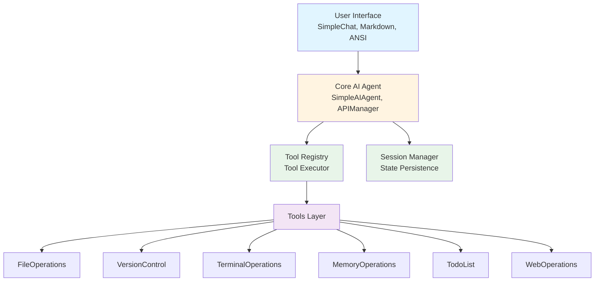
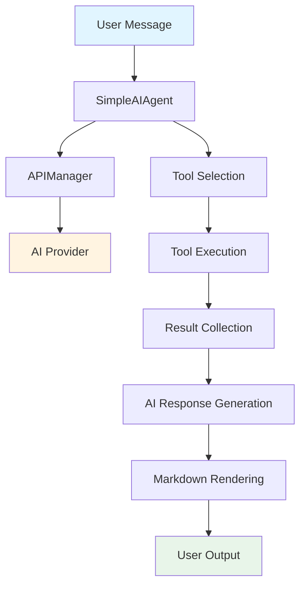
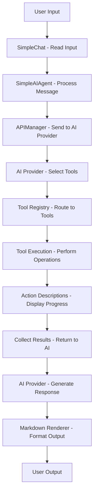
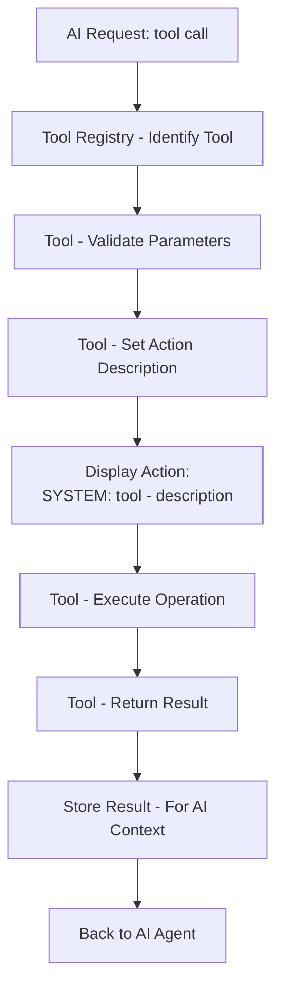
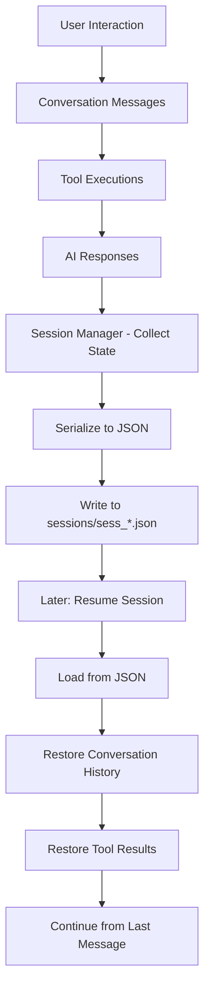
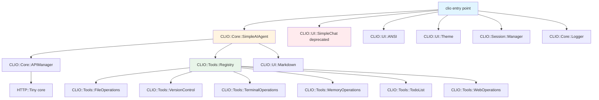

# CLIO Architecture Specification

**System design and technical architecture for CLIO**

---

## Overview

CLIO (Command Line Intelligence Orchestrator) is built on a modular Perl architecture that prioritizes extensibility, transparency, and user experience. This document describes the system components, data flows, and design decisions.

---

## Design Principles

### 1. No External Dependencies

CLIO uses **only core Perl modules** (standard library). No CPAN dependencies required.

**Rationale:** Simplifies installation, reduces maintenance burden, ensures portability.

**Core modules used:**
- `JSON` - JSON parsing (core since 5.14)
- `HTTP::Tiny` - HTTP client (core since 5.14)
- `MIME::Base64` - Encoding (core)
- `File::Spec`, `File::Path` - File operations (core)
- `Time::HiRes` - Timing (core)

### 2. Tool-Powered Architecture

AI doesn't hallucinate system state—it uses **real tools** to interact with the environment.

**Benefits:**
- Accurate file contents (read_file tool)
- Actual command output (execute_command tool)
- Real git status (git_status tool)
- Verifiable operations (action descriptions)

### 3. Action Transparency

Every tool operation shows **exactly what it's doing** via action descriptions.

**Example:**
```
SYSTEM: [file_operations] - Reading ./src/main.c (247 lines)
SYSTEM: [git] - Executing git status in ./
SYSTEM: [terminal] - Executing: perl -c lib/Module.pm
```

**Rationale:** Users should always know what CLIO is reading, writing, or executing.

### 4. Session Persistence

Conversations are **automatically saved** with full history and can be resumed exactly.

**Storage:** JSON files in `sessions/` directory  
**Format:** Complete conversation history + metadata  
**Resumption:** Full state restoration including tool results

### 5. Terminal-First UX

Professional terminal UI with markdown rendering, syntax highlighting, and color coding.

**Components:**
- ANSI escape codes for formatting
- Streaming markdown renderer
- Theme system for color schemes
- Real-time action descriptions

---

## System Architecture

### High-Level Component Diagram



### Core Components

#### 1. SimpleAIAgent (`lib/CLIO/Core/SimpleAIAgent.pm`)

**Responsibilities:**
- Manage conversation flow
- Orchestrate tool execution
- Handle streaming responses
- Coordinate with API manager

**Key Methods:**
- `new()` - Initialize agent
- `chat()` - Process user message
- `execute_tools()` - Execute selected tools
- `process_response()` - Handle AI response

**Data Flow:**


#### 2. APIManager (`lib/CLIO/Core/APIManager.pm`)

**Responsibilities:**
- Abstract AI provider APIs
- Handle authentication
- Manage streaming responses
- Error handling and retries

**Supported Providers:**
- GitHub Copilot (GPT-4o, Claude 3.5, o1) - default
- OpenAI (GPT-4, GPT-3.5-turbo, etc.)
- DeepSeek (deepseek-coder)
- llama.cpp (local inference)
- SAM (local assistant)
- Extensible for future providers

**Provider Detection:**
```perl
# Auto-detect based on environment variables
if ($ENV{GITHUB_COPILOT_TOKEN}) {
    # Use GitHub Copilot provider (default)
} elsif ($ENV{OPENAI_API_KEY}) {
    # Use OpenAI provider
} elsif ($ENV{DEEPSEEK_API_KEY}) {
    # Use DeepSeek provider
}
```

**Request Format:**
```json
{
  "model": "gpt-4o",
  "messages": [...],
  "tools": [...],
  "stream": true
}
```

#### 3. Tool Registry (`lib/CLIO/Tools/Registry.pm`)

**Responsibilities:**
- Register all available tools
- Route operations to appropriate tools
- Provide tool definitions for AI
- Manage tool execution

**Tool Registration:**
```perl
$registry->register_tool(CLIO::Tools::FileOperations->new());
$registry->register_tool(CLIO::Tools::VersionControl->new());
$registry->register_tool(CLIO::Tools::TerminalOperations->new());
# ... etc
```

**Tool Definition Format:**
```json
{
  "type": "function",
  "function": {
    "name": "file_operations",
    "description": "Perform file operations...",
    "parameters": {
      "type": "object",
      "properties": {
        "operation": {...},
        "path": {...}
      },
      "required": ["operation"]
    }
  }
}
```

#### 4. Session Manager (`lib/CLIO/Session/Manager.pm`)

**Responsibilities:**
- Create new sessions
- Load existing sessions
- Persist conversation history
- Manage session state

**Session Structure:**
```json
{
  "id": "sess_20260118_143052",
  "created_at": "2026-01-18T14:30:52Z",
  "model": "gpt-4o",
  "conversation": [
    {
      "role": "user",
      "content": "Hello"
    },
    {
      "role": "assistant",
      "content": "Hi! How can I help?"
    }
  ],
  "state": {
    "tool_results": {...},
    "metadata": {...}
  }
}
```

**Session Lifecycle:**
```
Create → Add Messages → Execute Tools → Save → [Resume] → Continue
```

#### 5. UI Components

**SimpleChat** (`lib/CLIO/UI/SimpleChat.pm` - deprecated, functionality moved to core)
- Chat interface
- Input handling
- Output formatting

**Markdown Renderer** (`lib/CLIO/UI/Markdown.pm`)
- Parse markdown
- Render with ANSI codes
- Syntax highlighting
- Streaming support

**ANSI Handler** (`lib/CLIO/UI/ANSI.pm`)
- ANSI escape codes
- @-code system (PhotonBBS style)
- Color definitions

**Theme System** (`lib/CLIO/UI/Theme.pm`)
- Color schemes
- Output templates
- Style management

---

## Data Flow Diagrams

### User Request Flow



### Tool Execution Flow



### Session Persistence Flow



---

## Tool Architecture

### Base Tool Class (`lib/CLIO/Tools/Tool.pm`)

**Methods provided to all tools:**
- `operation_success($result)` - Return success
- `operation_error($message)` - Return error
- `set_action_description($desc)` - Set action description
- `get_action_description()` - Retrieve action description

**Tool Interface:**
```perl
package CLIO::Tools::MyTool;
use parent 'CLIO::Tools::Tool';

sub new {
    return $class->SUPER->new(
        name => 'tool_name',
        description => 'What it does',
        supported_operations => [qw(op1 op2)],
    );
}

sub route_operation {
    my ($self, $operation, $params, $context) = @_;
    
    $self->set_action_description("doing something");
    
    # Execute operation
    my $result = ...;
    
    return $self->operation_success($result);
}
```

### Available Tools

**FileOperations** (`lib/CLIO/Tools/FileOperations.pm`)
- read_file, write_file, create_file, delete_file
- list_dir, file_search, grep_search, semantic_search
- replace_string, get_file_info, file_exists
- get_errors, list_code_usages, read_tool_result

**VersionControl** (`lib/CLIO/Tools/VersionControl.pm`)
- git_status, git_diff, git_log
- git_commit, git_push, git_pull
- git_branch, git_checkout, git_merge, git_reset

**TerminalOperations** (`lib/CLIO/Tools/TerminalOperations.pm`)
- execute_command
- get_terminal_output

**MemoryOperations** (`lib/CLIO/Tools/MemoryOperations.pm`)
- store, retrieve, search
- list_memories, delete

**TodoList** (`lib/CLIO/Tools/TodoList.pm`)
- read, write, update, add

**WebOperations** (`lib/CLIO/Tools/WebOperations.pm`)
- fetch_webpage

---

## Security Considerations

### Path Sanitization

File operations sanitize paths to prevent directory traversal:

```perl
use File::Spec;
my $safe_path = File::Spec->canonpath($path);
```

### Command Injection Prevention

Terminal operations should validate inputs (currently basic implementation).

**Future improvement:**
```perl
# Whitelist-based validation
# Input sanitization
# Use IPC::Run instead of system() when available
```

### API Token Security

Tokens stored in environment variables, never in code or sessions.

```perl
$ENV{GITHUB_COPILOT_TOKEN}  # Not stored in session files
```

---

## Configuration System

### Environment Variables

**Primary configuration method:**
```bash
GITHUB_COPILOT_TOKEN  # AI provider token (default)
OPENAI_API_KEY        # OpenAI provider
DEEPSEEK_API_KEY      # DeepSeek provider
CLIO_SESSION_DIR      # Custom session directory
CLIO_MODEL            # Model selection
CLIO_LOG_LEVEL        # Debug level (automatically set by --debug flag)
```

### Configuration File

**Optional YAML config** (`~/.clio/config.yaml`):
```yaml
ai_provider: github_copilot
model: gpt-4o
session:
  directory: ~/.clio/sessions
logging:
  level: info
```

**Precedence:** Environment variables > Config file > Defaults

---

## Extension Points

### Adding Tools

1. Create `lib/CLIO/Tools/NewTool.pm` extending `Tool.pm`
2. Implement `route_operation()` method
3. Register in `Registry.pm`

### Adding AI Providers

1. Create `lib/CLIO/Core/Providers/NewProvider.pm`
2. Implement `send_request()` and `parse_response()`
3. Add detection logic in `APIManager.pm`

### Adding UI Themes

1. Define color scheme in `Theme.pm`
2. Add templates for output formats
3. Switch via configuration

---

## Performance Considerations

### Streaming Responses

AI responses stream in real-time for better UX:
```perl
# Process chunks as they arrive
while (my $chunk = read_stream()) {
    render_partial_markdown($chunk);
}
```

### Markdown Rendering Optimization

**Periodic buffer flush:**
```perl
# Flush buffer every 100ms or 1KB
# Prevents accumulation while maintaining smooth rendering
```

### Session File Size

**Mitigation strategies:**
- JSON files (human-readable but compact)
- Optional compression for large sessions
- Periodic cleanup of old sessions

---

## Future Architecture Enhancements

### Planned Improvements

1. **Plugin System** - Dynamic tool loading
2. **Protocol Layer** - Higher-level abstractions over tools
3. **Caching Layer** - Cache frequent operations
4. **Background Jobs** - Async tool execution
5. **Multi-Session** - Work with multiple sessions simultaneously

---

## Appendix: Module Dependency Graph



**Core module count:** ~20 active modules  
**Deprecated modules:** ~10 (in lib/CLIO/UI/deprecated/)

---

**For more information:**
- [DEVELOPER_GUIDE.md](../DEVELOPER_GUIDE.md) - How to extend CLIO
- [TOOLS.md](TOOLS.md) - Complete tool reference
- [PROTOCOLS.md](PROTOCOLS.md) - Protocol specifications
